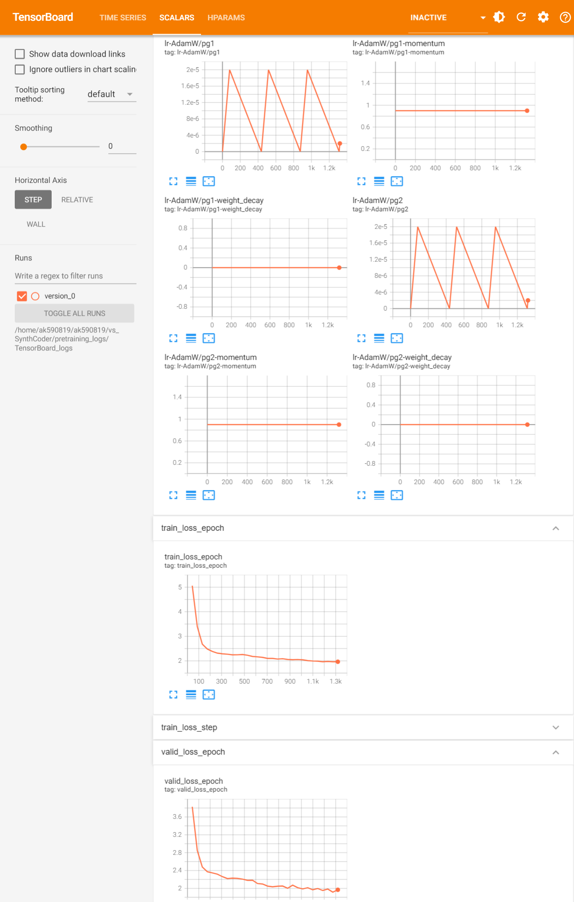
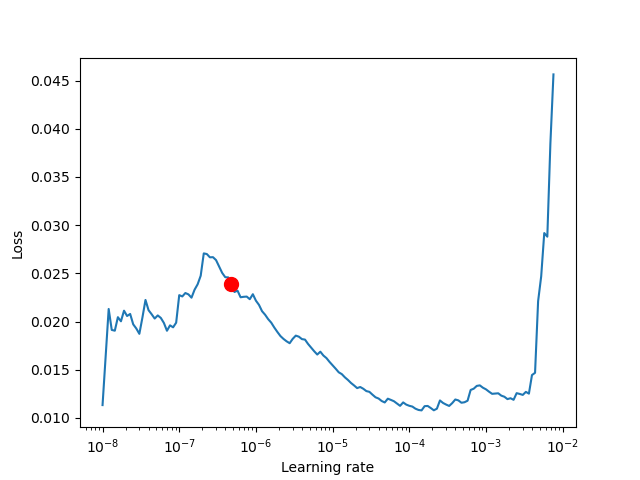
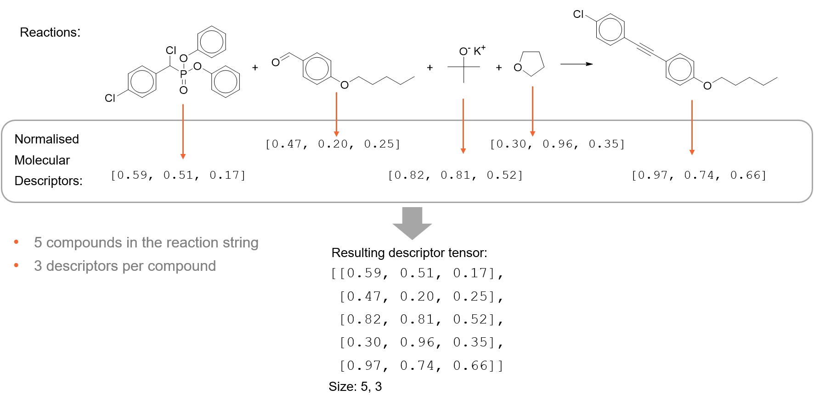
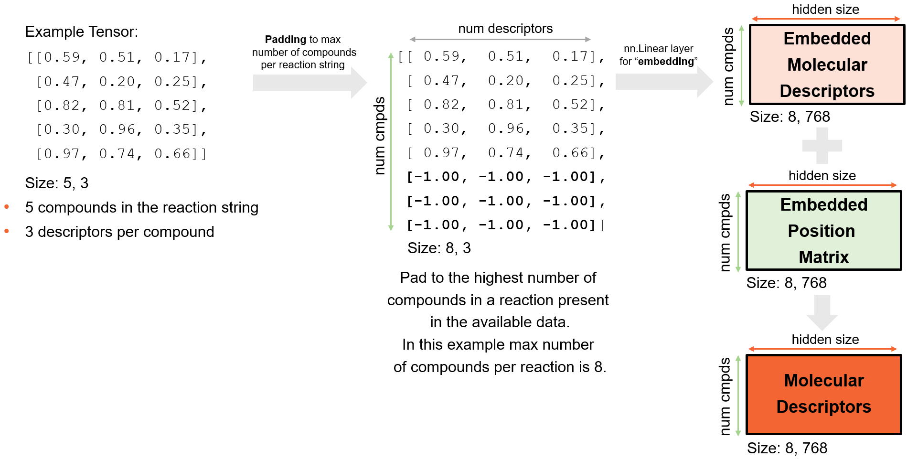
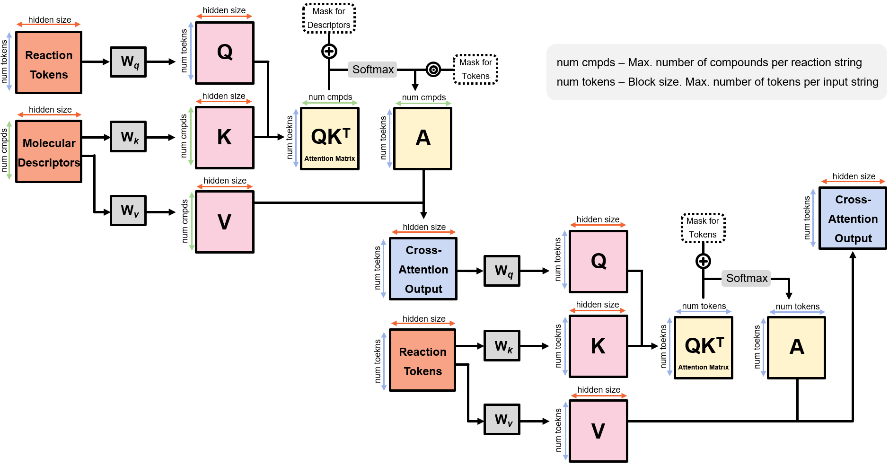
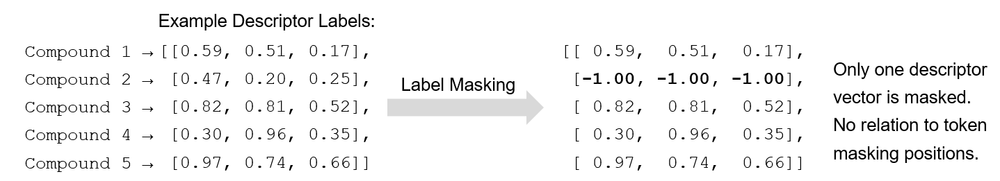
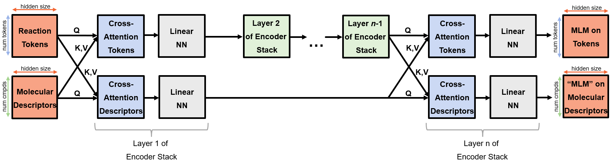
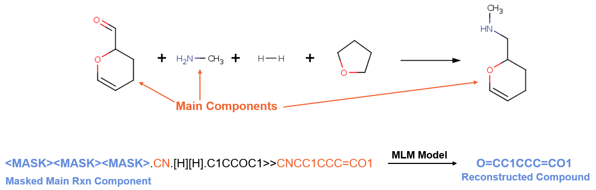
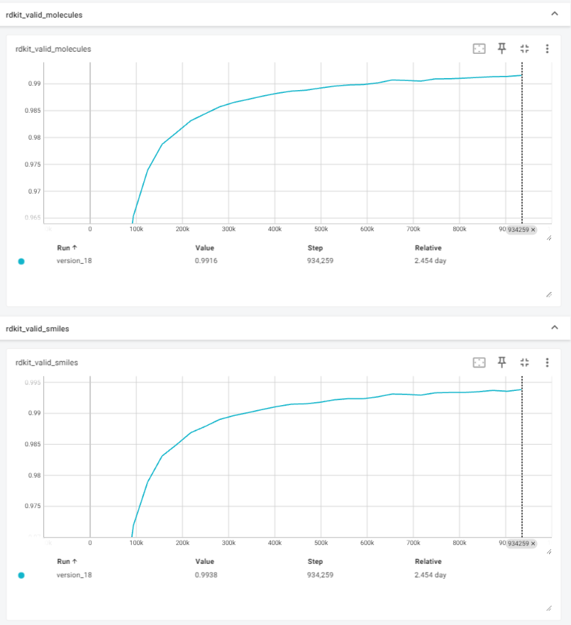

# Welcome to the SynthCoder Repo
**A Mini-Platform for Transformer-Based Encoder Training, Validation, Testing and Inference in Chemistry**

_Developed by GSK Cheminformatics: Adrian Krzyzanowski and Peter Pogany_

**Synthcoder** is a GSK's mini-platform for creating encoder models. The main focus of SynthCoder is a model creation and validation for organic chemistry, 
however, the platform can be used also with the regular human language or other text-based problems, e.g., protein sequences.

Currently supported capabilities include:
- Masked Language Modelling (MLM)
- Binary and Multi-Class Classification
- Regression

So far the tested and supported models are:
- BERT
- DistilBERT

Synthcoder is built with the [PyTorch Lightning](https://lightning.ai/docs/pytorch/stable/) framework.
The platform is strongly based on the [HuggingFace](https://huggingface.co/) libraries and it is intended to be used with the [HuggingFace](https://huggingface.co/) models, configuration files and tokenizers.  
Some functionality and settings are also based on/inspired by the [SimpleTransformers](https://simpletransformers.ai/) library, 
however, SynthCoder is not dependent on [SimpleTransformers](https://simpletransformers.ai/), and does not import any of its modules or functions. 
Despite some similarities in use, SynthCoder and [SimpleTransformers](https://simpletransformers.ai/) should be considered as two unrelated entities in order to avoid any potential confusion when using this platform. 

## TODO

- [ ] Significantly exapand the unit-testing. 


# Installation

The platform requires the following packages to be installed, together with their dependencies:

| Package Name | Version |
| --- | --- |
| `cudatoolkit` | 11.8.0 |
| `cudnn` | 8.8.0 |
| `pytorch` | 2.1.1 (pytorch-cuda=11.8) |
| `lightning` | 2.1.2 |
| `torchmetrics` | 1.2.1 |
| `transformers` | 4.33.3 |
| `datasets` | 2.15.0 |
| `tensorboardx` | 2.6.2.2 |
| `pandas` | 2.1.3 |
| `torch-optimizer` | 0.3.0 |
| `matplotlib` | 3.8.2 |
| `pytest` | 7.4.4 |
| `rdkit` | 2023.09.5 |
| `jpype1` | 1.5.0 |


The **Python version** used is: **3.9.18**


> [!TIP]
> Installation of the above packages is **very likely to fail with** [Conda](https://docs.conda.io).
> It is advised to install all the above packages using **[Mamba](https://mamba.readthedocs.io)** instead.


To install the necessary environment please use the following commands:

``` bash
mamba create --name synthcoder_env python=3.9.18
mamba env update -n synthcoder_env --file ./doc_files/environment.yml
```

You can now activate you enviroment through either:
``` bash
source activate synthcoder_env
```
Or, when not using HPC:
``` bash
mamba activate synthcoder_env
``` 

### PyTest

In the current form the implemented PyTests essentially perform rudimentary "End-to-End" test of the most basic platform functionality, checking for the general integrity of the training, validation, testing and inference. Currently, PyTest reads directly from the explicit files located in the `.pytest_files` folder. 

As the model `.ckpt` and `.ckpt.dir` files are too large to be uploaded to GitHub, the tests in PyTest generate their own `.ckpt` and `.ckpt.dir` files which are then used by the following tests... This means that if one test fails, all the following tests dependent on its checkpoint will fail as well. 

`DeprecationWarning` and `UserWarning` are disabled to filter out a number of the internal warnings coming from the imported libraries.

To check if the script works as expected run PyTest in the command line:
```
pytest
```

Some warnings are expected (but please, make sure that you examine the warnings), as long as all the tests pass. 


# General Platform Functionality

The mini-platform allows to train, validate and test encoder models, and then use the generated models to perform inference on unlabelled input data.

The tokenizer vocabulary can be provided explicitly to the model, or it can be trained based on the provided training `.txt` file. The input data for the training, validation and inference are provided as a `.csv` file (the file can still be `.txt` in case of the MLM models). Training and validation of classification and regression models require two columns of data: `text` - the text-based input for the model (e.g., a reaction string or protein sequence) and `labels` - the desired model output (the accepted data-types for labels are `int` for _classification_ and `float` for _regression_). Inference requires a `.csv` file with columns: `text` - the text-based input for the model and `idx` - an index or a number that uniquely identifies the given input example.

The model runs with all the associated metrics are logged as TensorBoard files and also as `.csv` files. Model training also generates model checkpoints as `.ckpt` files and as `.ckpt.dir` file directories, which allow to restart the training from the given checkpoint, or use the saved files for the later model fine-tuning, evaluation, testing or inference.    

The platform allows you to use a number of [settings](#settings) which give a tight control over the training process. These include, among many, the choice of the available devices (such as CPUs, GPUs, TPUs) and their number, the type of the backend for the [Lightning](https://lightning.ai/docs/pytorch/stable/) framework ([DDP](https://pytorch.org/docs/stable/generated/torch.nn.parallel.DistributedDataParallel.html#torch.nn.parallel.DistributedDataParallel), [DP](https://pytorch.org/docs/stable/generated/torch.nn.DataParallel.html), etc.), [precision of calculations](https://nvlabs.github.io/eccv2020-mixed-precision-tutorial/files/dusan_stosic-training-neural-networks-with-tensor-cores.pdf) (64 bit, 32 bit and 16 bit-mixed precision), optimisers ([AdamW](https://pytorch.org/docs/stable/generated/torch.optim.AdamW.html#torch.optim.AdamW) or [Adafactor](https://pytorch-optimizer.readthedocs.io/en/latest/_modules/torch_optimizer/adafactor.html)), schedulers (such as [cosine scheduler](https://huggingface.co/docs/transformers/main_classes/optimizer_schedules#transformers.get_cosine_schedule_with_warmup), [cyclic learning rate](https://pytorch.org/docs/stable/generated/torch.optim.lr_scheduler.CyclicLR.html#cycliclr), etc.), option to incorporate the [stochastic weight averaging](https://pytorch.org/blog/stochastic-weight-averaging-in-pytorch/) or an option to explicitly specify [weight decay](https://paperswithcode.com/method/weight-decay) for the selected layers.

Thanks to the [Lightning](https://lightning.ai/docs/pytorch/stable/) framework the platform can also give you a hint about the optimal learning rate after performing an [automated learning rate search](https://lightning.ai/docs/pytorch/stable/advanced/training_tricks.html#learning-rate-finder) using an untrained model.

## Core Modules of the SynthCoder Mini-Platform

The mini-platform is constructed using the following core modules:

```
synthcoder_project/
├── __init__.py
├── model_args.py
├── synthcoder_config.py
├── synthcoder.py
├── synthcoder_ust.py
├── utilities.py
│
├──lightning_modules/
│   ├── __init__.py
│   ├── lightning_callbacks.py
│   ├── lightning_data_module.py
│   └── lightning_model_module.py
│
├──synthcoder_tokenizers/
│   ├── __init__.py
│   ├── reaction_tokenizers.py
│   └── tokenizer_trainers.py
│
├──encoders/
│   ├── __init__.py
│   ├── bert_configs.py
│   ├── bert_cross_attention.py
│   ├── bert_encoders.py
│   └── bert_poolers.py
│
└──custom_collators/
    ├── __init__.py
    └── custom_collators.py
```

### `synthcoder_project` folder:

* `model_args.py` - This module contains classes with argument lists, needed for controlling the behaviour of the platform, including the settings governing the models, training, schedulers, optimiser, etc. 

* `synthcoder_config.py` - Contains some constant variables used by different objects and functions of the platform.

* `synthcoder.py` - ***The main module*** containing the `SynthCoderModeling` class, which puts the whole mini-platform together. It is responsible for controlling the data and the model preparation, as well as for managing the overall training/validation/etc. processes. `SynthCoderModeling` uses the [Pytorch Lightning's](https://lightning.ai/docs/pytorch/stable/) [`Trainer`](https://lightning.ai/docs/pytorch/stable/common/trainer.html) for controlling the models. 

* `synthcoder_ust.py` - Module containing the `SynthCoderModelingUST` class. `SynthCoderModelingUST` is a wrapper of `SynthCoderModeling`, and should be used solely for the [UST-based training](https://www.microsoft.com/en-us/research/uploads/prod/2020/06/ust_neurips_2020.pdf). 

* `utilities.py` - Contains general utility functions, that can be easily accessed from other modules.

* ###  ⮡ `lightning_modules` folder:

    * `lightning_callbacks.py` - Module containing custom [callbacks](https://lightning.ai/docs/pytorch/stable/extensions/callbacks.html) for the [Pytorch Lightning's](https://lightning.ai/docs/pytorch/stable/) [`Trainer`](https://lightning.ai/docs/pytorch/stable/common/trainer.html), modifying the behaviour of the model runs.   

    * `lightning_data_module.py` - This is a module containing the data preparation functionality. It prepares all the necessary data provided as files to be fed into the model during the training, validation, etc. It is also used to set-up and train a tokenizer. The data preparation classes in this module extend the [Pytorch Lightning's](https://lightning.ai/docs/pytorch/stable/) [`LightningDataModule`](https://lightning.ai/docs/pytorch/stable/data/datamodule.html) class. [Pytorch Lightning's](https://lightning.ai/docs/pytorch/stable/) [`Trainer`](https://lightning.ai/docs/pytorch/stable/common/trainer.html) can automatically call some of the class methods in this module. 

    * `lightning_model_module.py` - This module contains the key functionality and the code for training, validation, testing etc. of the supported models. Schedulers, optimisers, performance metrics are defined here. The MLM, classification, etc. classes in this module extend the [Pytorch Lightning's](https://lightning.ai/docs/pytorch/stable/) [`LightningModule`](https://lightning.ai/docs/pytorch/stable/common/lightning_module.html) class. [Pytorch Lightning's](https://lightning.ai/docs/pytorch/stable/) [`Trainer`](https://lightning.ai/docs/pytorch/stable/common/trainer.html) can automatically call some of the class methods in this module.  

* ###  ⮡ `synthcoder_tokenizers` folder:

    * `reaction_tokenizers.py` - Module containing modified and model specific "fast" [HuggingFace](https://huggingface.co/) tokenizers intended for the use in predictive synthesis.

    * `tokenizer_trainers.py` - Module containing tokenizer trainer class(es). Used for preparing new tokenizers with integrated normalisation and pre-tokenization.  

* ###  ⮡ `encoders` folder:
    
    * `bert_configs.py` - Module with modified [HuggingFace](https://huggingface.co/) configuration for custom BERT models. 

    * `bert_cross_attention.py` - Module with custom model components for processing an additional to tokens source of information through cross-attention mechanisms. This cross-attention mechanism is for encoders only.

    * `bert_encoders.py` - Module with modified [HuggingFace](https://huggingface.co/) BERT models. 
    
    * `bert_poolers.py` - Module with various poolers for modified BERT models. These only work with the custom models from this folder.


* ###  ⮡ `custom_collators` folder:

    * `custom_collators.py` - Module with modified [HuggingFace](https://huggingface.co/) collators for data preparation and modification before feeding the data into the models.


## Usage examples

> [!WARNING]
> None of the [DDP](https://pytorch.org/docs/stable/generated/torch.nn.parallel.DistributedDataParallel.html#torch.nn.parallel.DistributedDataParallel) distributed backends (except for DDP Notebook/Fork) is supported when using Jupyter notebooks or IPython environments. Thus, it is recommended to use SynthCoder through the `.py` based scripts.

### Understanding the available tokenization options:

SynthCoder uses two libraries for the training and then later application of the tokenizers. These libraries are: "[Tokenizers](https://github.com/huggingface/tokenizers)" and "[Transformers](https://github.com/huggingface/transformers)", both developed by HuggingFace. 

The tokenizers from the [Tokenizers](https://github.com/huggingface/tokenizers) library are used solely for training of new tokenizers. The tokenizers form this library are completely model agnostic (they do not care if they train for later use with BERT, RoBERTa or DeBERTa-v2, etc.). 
SynthCoder supports the use of the following [Tokenizers](https://github.com/huggingface/tokenizers) tokenizers:
* `ByteLevelBPETokenizer`
* `CharBPETokenizer`
* `BertWordPieceTokenizer`
* `SentencePieceUnigramTokenizer`
* `SentencePieceBPETokenizer`

The tokenizers from the [Transformers](https://github.com/huggingface/transformers) library are specific for a given Transformer-based model. They can accept files from any of the trained [Tokenizers](https://github.com/huggingface/tokenizers) tokenizers listed above, and when they generate output, the output is intended to be used by a particular model (e.g. BERT).
Examples of the [Transformers](https://github.com/huggingface/transformers) tokenizers include:
* `BertTokenizerFast`
* `DistilBertTokenizerFast`


> [!WARNING]
> Only the "Fast" versions of the [Transformers](https://github.com/huggingface/transformers) tokenizers are supported by SynthCoder. The "regular" versions of the [Transformers](https://github.com/huggingface/transformers) tokenizers do not seem to be compatible with the files/models generated by the [Tokenizers](https://github.com/huggingface/tokenizers) tokenizers.

#### Tokenization settings:

There are a number of available tokenizer specific settings.
Please consult the [Tokenizer Settings](#tokenizer-settings) section to read the descriptions of the available tokenizer options.

#### Examples of different tokenization approaches:

We will first try to use `WordPieceTokenizer` on reaction strings, where the reaction strings will be split during the pre-tokenization using "(", ")", "." and ">>" symbols. After the splitting, symbols "(" and ")" will be merged with the next token and with the previous token, respectively, whereas "." and ">>" will be kept in isolation.

Settings:
```
tokenizer_train_file="data/data_examples/photoredox_train.txt"
model_tokenizer=BertTokenizerFast
tokenizer_trainer_class_name="BertWordPieceTokenizer"
tokenizer_vocab_size=128,
tokenizer_min_frequency=2,
tokenizer_pattern_split=["\(|\[", "\)|\]", "\.|>>"],
tokenizer_split_behavior=["merged_with_next", "merged_with_previous", "isolated"],
```

> [!CAUTION]
> When using the regex patterns, please, remember about escaping the desired symbols, just as shown in the above example. Otherwise, the tokenization will not give the expected results.


Input:
```
"CS(C)=O.C1CCCCN1.C1CN2CCN1CC2.C(COC)OC.Cl[Ni]Cl.c1cc(COC(=O)N2CCC[C@@H]2C(c2c[nH]c3ccc(Br)cc23)=O)ccc1.F[P-](F)(F)(F)(F)F.CC(C)(C)c1cc(ncc1)-c2cc(ccn2)C(C)(C)C.n1c(-c2ccccc2[Ir]c3c(-c4ncccc4)cccc3)cccc1>>c1cc(COC(=O)N2CCC[C@@H]2C(c2c[nH]c3ccc(N4CCCCC4)cc23)=O)ccc1"
```

Gives the following tokens:

```
['CS', '(C)', '=O', '.', 'C1CCCCN1', '.', 'C1CN2CCN1CC2', '.', 'C', '(COC)', 'OC', '.', 
'Cl', '[Ni]', 'Cl', '.', 'c1cc', '(C', '##OC', '(=O)', 'N', '##2', '##CCC', '[C@', '##@', 
'##H]', '2', '##C', '(', '##c2', '##c', '[', '##n', '##H]', 'c', '##3', '##cc', '##c', '(', 
'##B', '##r', '##)', 'cc2', '##3)', '=O', '##)', 'ccc', '##1', '.', 'F', '[', '##P', '##-', 
'##]', '(F)', '(F)', '(F)', '(F)', 'F', '.', 'CC', '(C)', '(C)', 'c1cc', '(', '##n', '##cc', 
'##1', '##)', '-', '##c2cc', '(cc', '##n', '##2)', 'C', '(C)', '(C)', 'C', '.', 'n', '##1', 
'##c', '(-c2', '##cccc', '##c2', '[', '##I', '##r', '##]', 'c', '##3', '##c', '(-', '##c', 
'##4', '##n', '##cccc', '##4', '##)', 'ccc', '##c3', '##)', 'ccc', '##c1', '>>', 'c1cc', '(C', 
'##OC', '(=O)', 'N', '##2', '##CCC', '[C@', '##@', '##H]', '2', '##C', '(', '##c2', '##c', 
'[', '##n', '##H]', 'c', '##3', '##cc', '##c', '(N', '##4', '##CCC', '##CC', '##4', '##)', 
'cc2', '##3)', '=O', '##)', 'ccc', '##1']
```

Increasing the vocabulary size to:
```
tokenizer_vocab_size=256
```

Results in more agglomerated tokens:
```
['CS', '(C)', '=O', '.', 'C1CCCCN1', '.', 'C1CN2CCN1CC2', '.', 'C', '(COC)', 'OC', '.', 
'Cl', '[Ni]', 'Cl', '.', 'c1cc', '(C', '##OC', '(=O)', 'N', '##2C', '##CC', '[C@@H]', '2C', 
'(c2c', '[nH]', 'c3c', '##cc', '(Br)', 'cc2', '##3)', '=O)', 'ccc1', '.', 'F', '[P-]', 
'(F)', '(F)', '(F)', '(F)', 'F', '.', 'CC', '(C)', '(C)', 'c1cc', '(ncc1)', '-c2cc', '(ccn2)', 
'C', '(C)', '(C)', 'C', '.', 'n1', '##c', '(-c2ccccc2', '[Ir]', 'c3c', '(-', '##c4n', 
'##cccc', '##4)', 'ccc', '##c3', '##)', 'ccc', '##c1', '>>', 'c1cc', '(C', '##OC', '(=O)', 
'N', '##2C', '##CC', '[C@@H]', '2C', '(c2c', '[nH]', 'c3c', '##cc', '(N4CCCCC4)', 'cc2', 
'##3)', '=O)', 'ccc1']
```

Using the same settings as above but now selecting `CharBPETokenizer`:
```
tokenizer_trainer_class_name="CharBPETokenizer"
```

Gives the following tokens with our reaction string:
```
['CS</w>', '(C)</w>', '=O</w>', '.</w>', 'C1CCCCN1</w>', '.</w>', 'C1CN2CCN1CC2</w>', '.</w>', 
'C</w>', '(COC)</w>', 'OC</w>', '.</w>', 'Cl</w>', '[Ni]</w>', 'Cl</w>', '.</w>', 'c1cc</w>', 
'(C', 'OC</w>', '(=O)</w>', 'N2', 'CC', 'C</w>', '[C@@H]</w>', '2C</w>', '(c2c</w>', 
'[nH]</w>', 'c3', 'ccc</w>', '(Br)</w>', 'cc2', '3)</w>', '=O)</w>', 'cc', 'c1</w>', '.</w>', 
'F</w>', '[P-]</w>', '(F)</w>', '(F)</w>', '(F)</w>', '(F)</w>', 'F</w>', '.</w>', 'CC</w>', 
'(C)</w>', '(C)</w>', 'c1cc</w>', '(ncc1)</w>', '-c2cc</w>', '(ccn2)</w>', 'C</w>', '(C)</w>', 
'(C)</w>', 'C</w>', '.</w>', 'n1c</w>', '(-c2cccc', 'c2</w>', '[Ir]</w>', 'c3c</w>', '(-', 
'c4', 'n', 'cccc', '4)</w>', 'cccc', '3)</w>', 'cccc', '1</w>', '>></w>', 'c1cc</w>', '(C', 
'OC</w>', '(=O)</w>', 'N2', 'CC', 'C</w>', '[C@@H]</w>', '2C</w>', '(c2c</w>', '[nH]</w>', 
'c3', 'ccc</w>', '(N4CCCCC4)</w>', 'cc2', '3)</w>', 
'=O)</w>', 'cc', 'c1</w>']
```


Changing the tokenizer trainer and the settings to:
```
tokenizer_train_file="data/data_examples/photoredox_train.txt"
model_tokenizer=BertTokenizerFast
tokenizer_trainer_class_name="SentencePieceBPETokenizer"
tokenizer_vocab_size=256,
tokenizer_min_frequency=2,
tokenizer_pattern_split="\.|>>",
tokenizer_split_behavior="isolated",
tokenizer_add_metaspace=True,
```
Now every token generated by `SentencePieceBPETokenizer` starting a "word" should be preceded by a metaspace "_". 

Gives the following output:
```
['▁CS(C)=O', '▁.', '▁C1CCCCN1', '▁.', '▁C1CN2CCN1CC2', '▁.', '▁C(COC)OC', '▁.', '▁Cl[Ni]Cl', 
'▁.', '▁c1', 'cc(C', 'OC(=O)N', '2', 'CCC', '[C@@H]', '2C', '(', 'c2', 'c', '[nH]', 'c3', 
'cc', 'c(', 'Br)cc', '2', '3)', '=O)', 'cc', 'c1', '▁.', '▁F[P-](F)(F)(F)(F)F', '▁.', 
'▁CC(C)(C)c1cc(ncc1)-c2cc(ccn2)C(C)(C)C', '▁.', '▁n1', 'c(-c2', 'ccccc2', '[Ir]c3c(', 
'-c4n', 'cccc', '4)', 'cccc3)', 'cccc', '1', '▁>>', '▁c1', 'cc(C', 'OC(=O)N', '2', 'CCC', 
'[C@@H]', '2C', '(', 'c2', 'c', '[nH]', 'c3', 'cc', 'c(N4CCCCC', '4', ')cc2', '3)', '=O)', 
'cc', 'c1']
```


### Getting started with the models:

The training, validation, testing and inference is very easy with SynthCoder.
Start by importing the [`SynthCoderModeling` class](#using-synthcodermodeling) (this is the only class that you will need to import from SynthCoder), then, define your custom model settings and initialise a new `SynthCoderModeling` object. During the initialisation the platform will set up the necessary data and model modules. 

When you initialise the `SynthCoderModeling` object, you should provide the HuggingFace(-based) model, model configuration and model tokenizer. You need to specify the task type (either _"mlm"_ for MLM/model pre-training, or _"classification"_/_"regression"_ for classification and regression [HuggingFace classification model are also used for regression]), the tokenizer training file (unless you are using already pretrained vocabulary), model training and validation files, and you can also specify the accelerator type, number of devices and the type of the distributed trainer strategy. During the object initialisation please also provide your custom model settings. 


### Setting up MLM model: 
```python
# Import DistilBERT model architecture, tokenizer and model config from HuggingFace 
from transformers import (DistilBertForMaskedLM,
                          DistilBertTokenizerFast, 
                          DistilBertConfig)
from synthcoder_project.synthcoder import SynthCoderModeling


custom_args = {"model_type": "distilbert",
               "tokenizer_vocab_size": 8192,
               "manual_seed": 42,
               "pad_to_multiple_of": 32,
               "num_train_epochs": 30,
               "batch_size_train": 4,
               "batch_size_eval": 32,
               "gradient_accumulation_steps": 8,
               "dataloader_num_workers": 1,
               "precision": "16-mixed",
               "logger_dir": "pretraining_logs",
               "log_every_n_steps": 1,
               "early_stopping_patience": 5,
               "scheduler": "cyclic_lr_scheduler",
               "cyclic_lr_scheduler_mode": "triangular",
               "cyclic_lr_scheduler_ratio_size_down": 0.27,
               "tokenizer_punctuation_split": True,
               }

mlm_model = SynthCoderModeling(model_encoder=DistilBertForMaskedLM,
                               model_config=DistilBertConfig,
                               model_tokenizer=DistilBertTokenizerFast,
                               task_type="mlm",
                               tokenizer_train_file="data/data_examples/photoredox_train.txt",
                               train_file="data/data_examples/photoredox_train.txt",
                               validation_file="data/data_examples/photoredox_validate.txt",
                               accelerator="auto",
                               distributed_trainer_strategy="auto",
                               user_args=custom_args,
                               )
```
> [!TIP]
> You can add any arguments you like (of course, assuming no name conflict with the existing arguments) to the argument dictionary that you pass to `SynthCoderModeling`. One useful idea for an additional argument is `"comments": "<your comments>"`, where you can add notes about the model or training. As all arguments are logged and saved with the model checkpoints, your comments will be easily accessible in the `model_args.json` generated for each model checkpoint. 

Here is a fragment of the content of `photoredox_train.txt` - the file used to train the tokenizer and the model:
```
CS(C)=O.C1CCCCN1.C1CN2CCN1CC2.C(COC)OC.Cl[Ni]Cl.c1cc(F)ccc1CNC(=O)c1nc(Br)c2c(nccc2)c1O.c1(O)ccc2c(c1)Oc1c(ccc(O)c1)C21c2c(cccc2)C(=O)O1>>c1cc(F)ccc1CNC(=O)c1c(O)c2c(cccn2)c(N2CCCCC2)n1
CS(C)=O.C1CCCCN1.C1CN2CCN1CC2.C(COC)OC.Cl[Ni]Cl.c1(C)cc(C#N)cc(C)c1Oc1c(Br)c(N)nc(Nc2ccc(C#N)cc2)n1.F[P-](F)(F)(F)(F)F.CC(C)(C)c1cc(ncc1)-c2cc(ccn2)C(C)(C)C.n1c(-c2ccccc2[Ir]c3c(-c4ncccc4)cccc3)cccc1>>c1(C)cc(C#N)cc(C)c1Oc1nc(Nc2ccc(C#N)cc2)nc(N)c1N1CCCCC1
CS(C)=O.C1CCCCN1.C1CN2CCN1CC2.C(COC)OC.Cl[Ni]Cl.n1(CC)c(=O)c2c(nc(N[C@H]3[C@H](O)CCC3)n2Cc2cc(Br)c(OC)cc2)n(CCO)c1=O.[Cl-].FC(F)(F)c1cc(-c2c3ccccc3[n+](-c3cc(C(F)(F)F)cc(C(F)(F)F)c3)c3c2cccc3)cc(C(F)(F)F)c1>>C1CCCCN1c1cc(Cn2c(N[C@H]3[C@H](O)CCC3)nc3n(CCO)c(=O)n(CC)c(=O)c23)ccc1OC
CS(C)=O.C1CCCCN1.C1CN2CCN1CC2.C(COC)OC.Cl[Ni]Cl.n1(CC)c(=O)c2c(nc(N[C@H]3[C@H](O)CCC3)n2Cc2cc(Br)c(OC)cc2)n(CCO)c1=O.c1cnc(-c2c(cccc2)[Ir](c3c(cccc3)-c4ccccn4)c5c(cccc5)-c6ccccn6)cc1>>C1CCCCN1c1cc(Cn2c(N[C@H]3[C@H](O)CCC3)nc3n(CCO)c(=O)n(CC)c(=O)c23)ccc1OC
CS(C)=O.C1CCCCN1.C1CN2CCN1CC2.C(COC)OC.Cl[Ni]Cl.c1(O)ccc2c(c1)Oc1c(ccc(O)c1)C21c2c(cccc2)C(=O)O1.C1CC(Oc2cc(F)ccc2Br)CCN1c1cc(-c2nn(CC(=O)O)nn2)on1>>C1CN(c2c(OC3CCN(c4cc(-c5nn(CC(=O)O)nn5)on4)CC3)cc(F)cc2)CCC1
CS(C)=O.C1CCCCN1.C1CN2CCN1CC2.C(COC)OC.Cl[Ni]Cl.CC(C)(C)OC(N1CCC2(CC1)c1cc(Cl)c(C)cc1[C@H](C(C)(C)NC(=O)C)C2)=O.[Cl-].FC(F)(F)c1cc(-c2c3ccccc3[n+](-c3cc(C(F)(F)F)cc(C(F)(F)F)c3)c3c2cccc3)cc(C(F)(F)F)c1>>CC(C)(C)OC(N1CCC2(CC1)c1cc(N3CCCCC3)c(C)cc1[C@H](C(C)(C)NC(=O)C)C2)=O
```

During the initialisation of `SynthCoderModeling`, the BertWordPieceTokenizer tokenizer created `vocab.txt` file in the `tokenizer_outputs` folder, that contains all the vocabulary generated by the tokenizer, and that will be used by the model in the following steps.


### Checking if tokenization works as expected:

Make sure you check that your selected tokenization settings give the expected results.
You can return the tokenizer used by the model by calling the `return_tokenizer()` method:

```python
tokenizer = mlm_model.return_tokenizer()

reaction_text = "CS(C)=O.C1CCCCN1.C1CN2CCN1CC2.C(COC)OC.Cl[Ni]Cl.[nH]1c2c3n(c(=O)c1=O)C(CC(=O)OC)CCc3cc(Br)c2.F[P-](F)(F)(F)(F)F.CC(C)(C)c1cc(ncc1)-c2cc(ccn2)C(C)(C)C.FC(F)(F)c1cnc(cc1)-c2c(cc(cc2F)F)[Ir]c3c(c(cc(F)c3)F)-c4ncc(C(F)(F)F)cc4>>C1CN(c2cc3c4n(c(=O)c(=O)[nH]c4c2)C(CC(OC)=O)CC3)CCC1"
encoding = tokenizer.encode(reaction_text)

print(encoding)
print(tokenizer.convert_ids_to_tokens(encoding))
```


The above piece of code should give in our case the following (or similar) output:
``` Bash
[2, 88, 6, 21, 7, 17, 26, 10, 80, 10, 92, 10, 21, 6, 81, 7, 70, 10, 66, 30, 89, 31, 66, 10, 30, 139, 31, 281, 6, 32, 6, 17, 26, 7, 64, 17, 26, 7, 21, 6, 71, 6, 17, 26, 7, 70, 7, 273, 6, 97, 7, 68, 10, 22, 30, 27, 9, 31, 6, 22, 7, 6, 22, 7, 6, 22, 7, 6, 22, 7, 22, 10, 71, 6, 21, 7, 6, 21, 7, 74, 6, 153, 7, 9, 86, 6, 152, 7, 21, 6, 21, 7, 6, 21, 7, 21, 10, 112, 6, 22, 7, 6, 22, 7, 159, 6, 99, 7, 9, 93, 6, 63, 6, 220, 7, 22, 7, 30, 115, 31, 105, 6, 32, 6, 63, 6, 22, 7, 73, 7, 22, 7, 9, 221, 6, 21, 6, 22, 7, 6, 22, 7, 22, 7, 219, 18, 18, 79, 6, 284, 6, 32, 6, 17, 26, 7, 32, 6, 17, 26, 7, 30, 139, 31, 278, 7, 21, 6, 71, 6, 70, 7, 17, 26, 7, 154, 7, 155, 3]
['[CLS]', 'CS', '(', 'C', ')', '=', 'O', '.', 'C1CCCCN1', '.', 'C1CN2CCN1CC2', '.', 'C', '(', 'COC', ')', 'OC', '.', 'Cl', '[', 'Ni', ']', 'Cl', '.', '[', 'nH', ']', '1c2c3n', '(', 'c', '(', '=', 'O', ')', 'c1', '=', 'O', ')', 'C', '(', 'CC', '(', '=', 'O', ')', 'OC', ')', 'CCc3cc', '(', 'Br', ')', 'c2', '.', 'F', '[', 'P', '-', ']', '(', 'F', ')', '(', 'F', ')', '(', 'F', ')', '(', 'F', ')', 'F', '.', 'CC', '(', 'C', ')', '(', 'C', ')', 'c1cc', '(', 'ncc1', ')', '-', 'c2cc', '(', 'ccn2', ')', 'C', '(', 'C', ')', '(', 'C', ')', 'C', '.', 'FC', '(', 'F', ')', '(', 'F', ')', 'c1cnc', '(', 'cc1', ')', '-', 'c2c', '(', 'cc', '(', 'cc2F', ')', 'F', ')', '[', 'Ir', ']', 'c3c', '(', 'c', '(', 'cc', '(', 'F', ')', 'c3', ')', 'F', ')', '-', 'c4ncc', '(', 'C', '(', 'F', ')', '(', 'F', ')', 'F', ')', 'cc4', '>', '>', 'C1CN', '(', 'c2cc3c4n', '(', 'c', '(', '=', 'O', ')', 'c', '(', '=', 'O', ')', '[', 'nH', ']', 'c4c2', ')', 'C', '(', 'CC', '(', 'OC', ')', '=', 'O', ')', 'CC3', ')', 'CCC1', '[SEP]']
```


### Training a MLM model:

Now you are all set to perform the MLM model training and validation (by default the validation is performed automatically at the end of each training epoch).

> [!NOTE]
> If you do not wish to perform the validation step during the model fitting, make sure that in your model arguments you set `limit_val_batches` to 0, and if early stopping is enabled, set the `early_stopping_metric` to "train_loss" or one of the training-based metrics (e.g. "train_R2Score"), instead of the validation loss. When no validation is to be performed, `validation_file` does not need to be provided when initialising the `SynthCoderModeling` object.

To perform the model fitting, simply use the `.fit_model()` method:
```python
mlm_model.fit_model()
```

Hurray, now your model should have been trained and validated. How can we access the results though?


### The logged results:

All the results and metrics generated during the model fitting have been automatically logged to the directory that we specified under `logger_dir`. 

The platform generated CSV logs and Tensorboard logs:

```
pretraining_logs
├── CSV_logs
│   └── version_0
│       ├── hparams.yaml
│       └── metrics.csv
└── TensorBoard_logs
    └── version_0
        ├── checkpoints
        │   ├── epoch=24-step=1100.ckpt
        │   ├── epoch=24-step=1100.ckpt.dir
        │   │   ├── config.json
        │   │   ├── model_args.json
        │   │   ├── pytorch_model.bin
        │   │   ├── special_tokens_map.json
        │   │   ├── tokenizer_config.json
        │   │   ├── training_args.bin
        │   │   └── vocab.txt
        │   ├── epoch=26-step=1188.ckpt
        │   ├── epoch=26-step=1188.ckpt.dir
        │   │   ├── config.json
        │   │   ├── model_args.json
        │   │   ├── pytorch_model.bin
        │   │   ├── special_tokens_map.json
        │   │   ├── tokenizer_config.json
        │   │   ├── training_args.bin
        │   │   └── vocab.txt
        │   ├── epoch=28-step=1276.ckpt
        │   ├── epoch=28-step=1276.ckpt.dir
        │   │   ├── config.json
        │   │   ├── model_args.json
        │   │   ├── pytorch_model.bin
        │   │   ├── special_tokens_map.json
        │   │   ├── tokenizer_config.json
        │   │   ├── training_args.bin
        │   │   └── vocab.txt
        │   ├── last.ckpt
        │   └── last.ckpt.dir
        │       ├── config.json
        │       ├── model_args.json
        │       ├── pytorch_model.bin
        │       ├── special_tokens_map.json
        │       ├── tokenizer_config.json
        │       ├── training_args.bin
        │       └── vocab.txt
        ├── events.out.tfevents.1706466534.stvun023.39964.0
        └── hparams.yaml
```

Each model run, logged under the same directory, will be named consecutively as `version_<number of the record in the directory>`. 
`TensorBoard_logs` contain files readable by TensorBoard and model checkpoints saved by default for the best three models and also for the last model produced during the training process. The data for the checkpoints are saved both as `.ckpt` file and as mostly human-readable files in the `.ckpt.dir` folders. These files contain all the necessary information to use for a model fine-tuning or a training re-start form a checkpoint.

In Tensorboard, you can track gradient norms, values of the optimiser’s parameters, loss (in this case loss for both training and validation) and when available other metrics associated with the classification and regression problems. 

_Screenshot of the Tensorboard window with some logged values for our run:_



> [!NOTE]
> The step number in the checkpoint names is +1 in comparison to the step number displayed on the TensorBoard charts.

### Fine-tuning a regression model:

After preparing our pre-trained model, we can now fine-tune the model on some labelled data. 
In the model arguments, we specify that `problem_type` is a regression with `num_labels` of 1 (see the [classification/regression model settings](#arguments-specific-for-classification-and-regression-models)). We also change the directory for the log files, to a dedicated folder for fine-tuned models. Any arguments that we provide here (such as the number of epochs, scheduler type, learning rate, etc.), will overwrite the previously defined model arguments for the pre-trained model. 

We create a new `SynthCoderModeling` object and fine-tune a regression model (`DistilBertForSequenceClassification`) based on the pre-trained weights from our `.ckpt.dir` checkpoint directory, that we generated for `DistilBertForMaskedLM`. Please note that `task_type` is now set to "regression". If you desire, you can already provide the paths for the test and prediction files, but it is not necessary for the model training. These files can be specified at a later stage. 

```python
from transformers import DistilBertForSequenceClassification

regression_args = {"num_labels": 1,
                   "problem_type": "regression",
                   "logger_dir": "fine_tuning_logs",
                   }

regression_model = SynthCoderModeling(model_encoder=DistilBertForSequenceClassification,
                                      model_config=DistilBertConfig,
                                      model_tokenizer=DistilBertTokenizerFast,
                                      task_type="regression",
                                      train_file="data/data_examples/photoredox_train.csv",
                                      validation_file="data/data_examples/photoredox_validate.csv",
                                      test_file=None,
                                      predict_file=None,
                                      accelerator="gpu",
                                      distributed_trainer_strategy="ddp",
                                      user_args=regression_args, 
                                      model_name="pretraining_logs/TensorBoard_logs/version_0/checkpoints/epoch=28-step=1276.ckpt.dir",
                                      )
regression_model.fit_model()
```

Here is a fragment of the content of `photoredox_train.csv` - the file used for fine-tuning: 
```
text,labels
CS(C)=O.C1CCCCN1.C1CN2CCN1CC2.C(COC)OC.Cl[Ni]Cl.c1cc(F)ccc1CNC(=O)c1nc(Br)c2c(nccc2)c1O.c1(O)ccc2c(c1)Oc1c(ccc(O)c1)C21c2c(cccc2)C(=O)O1>>c1cc(F)ccc1CNC(=O)c1c(O)c2c(cccn2)c(N2CCCCC2)n1,0.0067899909999999
CS(C)=O.C1CCCCN1.C1CN2CCN1CC2.C(COC)OC.Cl[Ni]Cl.c1(C)cc(C#N)cc(C)c1Oc1c(Br)c(N)nc(Nc2ccc(C#N)cc2)n1.F[P-](F)(F)(F)(F)F.CC(C)(C)c1cc(ncc1)-c2cc(ccn2)C(C)(C)C.n1c(-c2ccccc2[Ir]c3c(-c4ncccc4)cccc3)cccc1>>c1(C)cc(C#N)cc(C)c1Oc1nc(Nc2ccc(C#N)cc2)nc(N)c1N1CCCCC1,0.020145328
CS(C)=O.C1CCCCN1.C1CN2CCN1CC2.C(COC)OC.Cl[Ni]Cl.n1(CC)c(=O)c2c(nc(N[C@H]3[C@H](O)CCC3)n2Cc2cc(Br)c(OC)cc2)n(CCO)c1=O.[Cl-].FC(F)(F)c1cc(-c2c3ccccc3[n+](-c3cc(C(F)(F)F)cc(C(F)(F)F)c3)c3c2cccc3)cc(C(F)(F)F)c1>>C1CCCCN1c1cc(Cn2c(N[C@H]3[C@H](O)CCC3)nc3n(CCO)c(=O)n(CC)c(=O)c23)ccc1OC,0.0
CS(C)=O.C1CCCCN1.C1CN2CCN1CC2.C(COC)OC.Cl[Ni]Cl.n1(CC)c(=O)c2c(nc(N[C@H]3[C@H](O)CCC3)n2Cc2cc(Br)c(OC)cc2)n(CCO)c1=O.c1cnc(-c2c(cccc2)[Ir](c3c(cccc3)-c4ccccn4)c5c(cccc5)-c6ccccn6)cc1>>C1CCCCN1c1cc(Cn2c(N[C@H]3[C@H](O)CCC3)nc3n(CCO)c(=O)n(CC)c(=O)c23)ccc1OC,0.042077694
CS(C)=O.C1CCCCN1.C1CN2CCN1CC2.C(COC)OC.Cl[Ni]Cl.c1(O)ccc2c(c1)Oc1c(ccc(O)c1)C21c2c(cccc2)C(=O)O1.C1CC(Oc2cc(F)ccc2Br)CCN1c1cc(-c2nn(CC(=O)O)nn2)on1>>C1CN(c2c(OC3CCN(c4cc(-c5nn(CC(=O)O)nn5)on4)CC3)cc(F)cc2)CCC1,0.0
CS(C)=O.C1CCCCN1.C1CN2CCN1CC2.C(COC)OC.Cl[Ni]Cl.CC(C)(C)OC(N1CCC2(CC1)c1cc(Cl)c(C)cc1[C@H](C(C)(C)NC(=O)C)C2)=O.[Cl-].FC(F)(F)c1cc(-c2c3ccccc3[n+](-c3cc(C(F)(F)F)cc(C(F)(F)F)c3)c3c2cccc3)cc(C(F)(F)F)c1>>CC(C)(C)OC(N1CCC2(CC1)c1cc(N3CCCCC3)c(C)cc1[C@H](C(C)(C)NC(=O)C)C2)=O,0.0
```
For classification and regression, the columns in the .csv file provided to the model have to be called "text" and "labels". For classification the labels should be integers (starting at 0), and for regression the labels should be floats. 


During the model initialisation we see the following information being displayed in the terminal:

```
Some weights of DistilBertForSequenceClassification were not initialized from the model checkpoint 
at pretraining_logs/TensorBoard_logs/version_0/checkpoints/last.ckpt.dir and are newly initialized: 
['classifier.weight', 'pre_classifier.bias', 'classifier.bias', 'pre_classifier.weight']
```

The weights for the matching layers between `DistilBertForMaskedLM` and `DistilBertForSequenceClassification` are copied to the new model, and the weights for layers which were not found in `DistilBertForMaskedLM` are newly initalised.

> [!NOTE]
> Model fine-tuning involves updating of all model weights, not just the new layers used for the classification/regression task. None of the layer weights are frozen during the fine-tuning process.

Hurray! We have successfully fine-tuned a DistilBERT model. All the collected metrics for fine-tuning can be accessed using TensorBoard. We should now test the model's performance and run some inference.

### Validation, Testing & Inference:

After training a model we can easily run validation (e.g. if the model needs to be validated on new data), testing and inference. 

The model can be loaded from a specific checkpoint, or if the validation/testing/inference is performed directly after the training stage, you can let the platform itself (through the functionality of [Lightning](https://lightning.ai/docs/pytorch/stable/)) select the best model for validation/testing/inference. We can also specify a new batch size and provide a new file for validation/testing/inference if needed or if it had not been specified before. The results of the validation/testing/inference can also be saved as a .csv file, if `csv_path_for_saving` is specified:

``` python
regression_model.validate_model(ckpt_path="fine_tuning_logs/TensorBoard_logs/version_0/checkpoints/epoch=20-step=924.ckpt",
                                csv_path_for_saving="./results/validation_results.csv")

regression_model.test_model(ckpt_path="fine_tuning_logs/TensorBoard_logs/version_0/checkpoints/epoch=20-step=924.ckpt",
                            new_test_file="data/data_examples/photoredox_test.csv",
                            csv_path_for_saving="./results/test_results.csv")

regression_model.predict(ckpt_path="fine_tuning_logs/TensorBoard_logs/version_0/checkpoints/epoch=20-step=924.ckpt",
                         new_predict_file="data/data_examples/photoredox_inference.csv",
                         csv_path_for_saving="./results/inference_results.csv")
```

> [!NOTE]
> When your model is trained using ***Stochastic Weight Averaging***, the methods `.validate_model()`, `.test_model()` and `.predict()` need to be used with the explicitly provided path to the checkpoint model `ckpt_path=<path to the .ckpt file>`. 


Here is a fragment of the content of `photoredox_inference.csv` - the file used for inference with the model. Columns named "idx" (for the entry index or ID) and "text" need to be present:

```
idx, text
1226, CS(C)=O.C1CCCCN1.C1CN2CCN1CC2.C(COC)OC.Cl[Ni]Cl.C([C@@H]1OC(=O)N(c2cc(F)c(I)cc2)C1)n1ccnn1.c1c(cc(c(-c2ccccn2)c1F)[Ir](c3cc(cc(c3-c4ccccn4)F)F)c5cc(cc(c5-c6ccccn6)F)F)F>>C1CCCCN1c1ccc(N2C[C@H](Cn3ccnn3)OC2=O)cc1F
439, CS(C)=O.C1CCCCN1.C1CN2CCN1CC2.C(COC)OC.Cl[Ni]Cl.FC(F)(F)[C@@]1(C#CC2CC2)OC(=O)Nc2c1cc(Cl)cc2.c1cnc(-c2c(cccc2)[Ir](c3c(cccc3)-c4ccccn4)c5c(cccc5)-c6ccccn6)cc1>>FC(F)(F)C1(C#CC2CC2)OC(=O)Nc2ccc(N3CCCCC3)cc21
1187, CS(C)=O.C1CCCCN1.C1CN2CCN1CC2.C(COC)OC.Cl[Ni]Cl.n1(CC)c(=O)c2c(nc(N[C@H]3[C@H](O)CCC3)n2Cc2cc(Br)c(OC)cc2)n(CCO)c1=O.[Cl-].FC(F)(F)c1cc(-c2c3ccccc3[n+](-c3cc(C(F)(F)F)cc(C(F)(F)F)c3)c3c2cccc3)cc(C(F)(F)F)c1>>C1CCCCN1c1cc(Cn2c(N[C@H]3[C@H](O)CCC3)nc3n(CCO)c(=O)n(CC)c(=O)c23)ccc1OC
80, CS(C)=O.C1CCCCN1.C1CN2CCN1CC2.C(COC)OC.Cl[Ni]Cl.n1c(C(OCC)=O)c2n(c1)-c1c(cc(Br)cc1)C(=O)N(C)C2.[Ru].F[P-](F)(F)(F)(F)F.F[P-](F)(F)(F)(F)F.c1cccc(-c2ccccn2)n1.c1cccc(-c2ccccn2)n1.c1cccc(-c2ccccn2)n1>>C1CCCCN1c1cc2c(cc1)-n1cnc(C(=O)OCC)c1CN(C)C2=O
13, CS(C)=O.C1CCCCN1.C1CN2CCN1CC2.C(COC)OC.Cl[Ni]Cl.FC(F)(F)[C@@]1(C#CC2CC2)OC(=O)Nc2c1cc(Cl)cc2.c1(O)ccc2c(c1)Oc1c(ccc(O)c1)C21c2c(cccc2)C(=O)O1>>FC(F)(F)C1(C#CC2CC2)OC(=O)Nc2ccc(N3CCCCC3)cc21
1230, CS(C)=O.C1CCCCN1.C1CN2CCN1CC2.C(COC)OC.Cl[Ni]Cl.C([C@@H]1OC(=O)N(c2cc(F)c(I)cc2)C1)n1ccnn1.c1(O)ccc2c(c1)Oc1c(ccc(O)c1)C21c2c(cccc2)C(=O)O1>>C1CCCCN1c1ccc(N2C[C@H](Cn3ccnn3)OC2=O)cc1F
```

Below are the validation and test results that we obtained for our photochemistry data with the model trained from scratch. 

***Validation results:***
```
┏━━━━━━━━━━━━━━━━━━━━━━━━━━━━━━━━━━━━━━━━━┳━━━━━━━━━━━━━━━━━━━━━━━━━━━━━━━━━━━━━━━━━┓
┃             Validate metric             ┃              DataLoader 0               ┃
┡━━━━━━━━━━━━━━━━━━━━━━━━━━━━━━━━━━━━━━━━━╇━━━━━━━━━━━━━━━━━━━━━━━━━━━━━━━━━━━━━━━━━┩
│      valid_ExplainedVariance_epoch      │           0.7030288577079773            │
│      valid_MeanAbsoluteError_epoch      │           0.07045868039131165           │
│ valid_MeanAbsolutePercentageError_epoch │             8243.736328125              │
│      valid_MeanSquaredError_epoch       │           0.01543336920440197           │
│           valid_R2Score_epoch           │           0.7010900378227234            │
│            valid_RMSE_epoch             │           0.12423111498355865           │
│            valid_loss_epoch             │           0.01543336920440197           │
└─────────────────────────────────────────┴─────────────────────────────────────────┘
```

***Test results:***
```
┏━━━━━━━━━━━━━━━━━━━━━━━━━━━━━━━━━━━━━━━━┳━━━━━━━━━━━━━━━━━━━━━━━━━━━━━━━━━━━━━━━━┓
┃              Test metric               ┃              DataLoader 0              ┃
┡━━━━━━━━━━━━━━━━━━━━━━━━━━━━━━━━━━━━━━━━╇━━━━━━━━━━━━━━━━━━━━━━━━━━━━━━━━━━━━━━━━┩
│      test_ExplainedVariance_epoch      │           0.6177314519882202           │
│      test_MeanAbsoluteError_epoch      │          0.06660597026348114           │
│ test_MeanAbsolutePercentageError_epoch │              7156.9453125              │
│      test_MeanSquaredError_epoch       │          0.018808560445904732          │
│           test_R2Score_epoch           │           0.6176463961601257           │
│            test_RMSE_epoch             │           0.1371443122625351           │
│            test_loss_epoch             │          0.018808560445904732          │
└────────────────────────────────────────┴────────────────────────────────────────┘
```

We've got R2 of 0.70 for the validation set and 0.62 for the test set. That's pretty good considering the lack of any hyperparameter optimisation, very small data set for the pre-training, and a small number of epochs!!!


***Inference Results:***

Here are the predictions, saved in the `inference_results.csv` file, generated during the inference for our reactions:
```
idx, prediction
1226, 0.40869140625
439, 0.002498626708984375
1187, 0.03741455078125
80, 0.6796875
13, -0.0018310546875
1230, 0.036285400390625
1085, 0.005462646484375
1118, -0.0078887939453125
1416, 0.2474365234375
124, 0.297607421875
1341, -0.0023593902587890625
1435, -0.0386962890625
1350, 0.418212890625
1702, 0.6201171875
1566, 0.003131866455078125
372, 0.7392578125
1682, 0.5556640625
1564, 0.01326751708984375
```

### Conclusions

We pretrained a model using MLM approach, and then fine-tuned it on labelled reaction data (reaction SMILES). The resulting model was tested on previously unseen reaction strings and then used for generating new predictions.

Training a new model just requires providing your desired settings and loading an appropriate and compatible HuggingFace (or HuggingFace-like) tokenizer, model and model config. To get the most out of the SynthCoder mini-platform, please, read through all the available [settings and model arguments](#settings).


### BONUS: Finding Learning Rate

You can also try finding an optimal learning rate for your model and data by using an automated [learning rate finder](https://lightning.ai/docs/pytorch/stable/api/lightning.pytorch.callbacks.LearningRateFinder.html#learningratefinder):

```
mlm_model.find_learning_rate()
```

The learning rate finder will print out what it thinks the optimal learning rate is.
The method will also save a Loss vs. Learning Rate chart. ***The proposed values are often very far from the optimal, so be careful when using this method.***




--------------------------------
# Additional SynthCoder Capabilities 

Our SynthCoder platform and the custom BERT model for synthesis with cross-attention (SynthBERTx), which works along SynthCoder, offer a plethora of novel capabilities for working with molecules and reactions. The model also offers additional, optional changes and improvements to the architecture. These capabilities are described below.

## Enriched Embeddings 

> [!CAUTION]
> This feature will only work for chemical reactions.

> [!IMPORTANT]
> **Compatible Model Classes:** `SynthBertXForMaskedLM`, `EnrichedEmbeddingBertForMaskedLM` or `EnrichedEmbeddingBertForSequenceClassification`.
> **Compatible Model Config Classes:** `EnrichedBertConfig`.
> **Compatible Tokenizer Classes:** `EnrichedBertTokenizerFast`.

SynthCoder and SynthBERTx reimplement the solution proposed for the [2023 Janssen's BEE model](https://doi.org/10.1186/s13321-023-00685-0), which allows to provide information about the reaction conditions to the model as part of the embedding layer.

To utilise the enriched embedding an additional column needs to be provided in the input files (training/validation/testing/inference): "enriching_classes".
A fragment of a .csv file containing information about the enriching classes:
```
text,enriching_classes,labels
CS(C)=O.C1CCCCN1.C1CN2CCN1CC2.C(COC)OC.Cl[Ni]Cl.CC1(C)C(c2ccc(S(=O)(=O)C)cc2)=C(Oc2ncc(Br)cc2)C(=O)O1.[Cl-].FC(F)(F)c1cc(-c2c3ccccc3[n+](-c3cc(C(F)(F)F)cc(C(F)(F)F)c3)c3c2cccc3)cc(C(F)(F)F)c1>>CC1(C)C(c2ccc(S(=O)(=O)C)cc2)=C(Oc2ncc(N3CCCCC3)cc2)C(=O)O1,"[10, 8, 9, 6, 6, 7, 5, 5]",0.18758965
CS(C)=O.C1CCCCN1.C1CN2CCN1CC2.C(COC)OC.Cl[Ni]Cl.FC(F)(F)[C@@]1(C#CC2CC2)OC(=O)Nc2c1cc(Cl)cc2.c1(O)ccc2c(c1)Oc1c(ccc(O)c1)C21c2c(cccc2)C(=O)O1>>FC(F)(F)C1(C#CC2CC2)OC(=O)Nc2ccc(N3CCCCC3)cc21,"[10, 9, 9, 6, 6, 7, 6]",0.0270484379999999
CS(C)=O.C1CCCCN1.C1CN2CCN1CC2.C(COC)OC.Cl[Ni]Cl.c1ccccc1N1C2C=CC=CC2Sc2ccccc21.CC(C)(C)OC(N1CCC2(CC1)c1cc(Cl)c(C)cc1[C@H](C(C)(C)NC(=O)C)C2)=O>>CC(C)(C)OC(N1CCC2(CC1)c1cc(N3CCCCC3)c(C)cc1[C@H](C(C)(C)NC(=O)C)C2)=O,"[10, 9, 9, 6, 6, 3, 7]",0.0078754926
``` 

The information about the enriching_classes does not need to be provided during pre-training and can be only provided during the fine-tuning stage. However, [`tokenizer_enrichment_vocab_size`](#tokenizer-settings) for the enrichment embeddigns should be already set to the desired value at the pre-training stage. No other flags/settings need to be changed in order to use the enriched embedding functinality.

Salts components can be represented in two ways, for example:
[Na+].[Cl-], and then the enriching_classes label will be e.g. [..., 4, 4, ...], or as [Na+]^[Cl-] and then the salt will have only one enriching_classes label which should be in this case just [..., 4, ...]. (Think about "." as a separator and "^" as a joiner between molecules).

For the enrichment classes to be assigned properly by the tokenizer to the appropriate tokens, compounds in the reactions need to be separated by ".", transformation into a product should be indicated by ">>" and salt components should be normally joined by "^" (or also separated by "." as discussed above). _Please note that the default ".", ">>" and "^" symbols can be changed in the [settings](#tokenizer-settings), though._

You need to specify the maximum vocabulary size of the enrichment classes, e.g. if the maximum number of the erichment classes in your input file is 30, set [`tokenizer_enrichment_vocab_size`](#tokenizer-settings) to at least this value + 4, so, a value >= (30 + 4). +4 is needed, as extra 4 tokens are reserved for special characters, reaction symbols and the product; the IDs assigned to these tokens are as follows:
- special token ID = 0
- molecular_separator ID = 1
- arrow symbol ID = 2
- reaction product ID = 3

Because of the reserved tokens, the IDs assigned to your enrichment classes will be automatically shifted by 4. So, enrichment class = 2 in the input file will be converted into enrichment ID = 6 during tokenization. 

As you can tell by the examples above, the product should not have any enrichment class assigned by the user in the file input, as the enrichment token will be assigned to it automatically by the tokenizer (enrichment ID = 3 is assigned to the last compound in the reaction string).

## Processing Descriptor Data

> [!IMPORTANT]
> **Compatible Model Classes:** `SynthBertXForMaskedLM`, `EnrichedEmbeddingBertForMaskedLM` or `EnrichedEmbeddingBertForSequenceClassification`.
> **Compatible Model Config Classes:** `EnrichedBertConfig`.
> **Compatible Tokenizer Classes:** `EnrichedBertTokenizerFast`.

SynthCoder used with SynthBERTx allows to calculate cross-attanetion between the tokens of the text-based input and any number of numerical values associated with this text-based input. This means, for example, that we can provide lists of descriptors for all compounds in a reaction, and the model will process both the reaction string and the numerical descriptors. **This feature does not need to be used only for chemical reactions, but can be used for any type of input, e.g. protein sequences, single molecules, experimental protocols, etc., so anywhere, where an additional numerical input alongside the text input could be benefficial for the model predictions**. 

The information about the embedded numerical data is transferred into the model through cross-attention with the embedded tokens. 
The input numerical values (which already should be appropriately scaled; e.g. molecular descriptors) are converted into a tensor:



The tensor is then padded with padding values ([`tokenizer_descriptors_padding_value`](#tokenizer-settings
) by default set to -1) to an appropriate size, and then embedded using a linear layer. The final embedding is a combination of the embedded input numbers and the positional information:



We currently experiment cross-attention approaches. The cross-attention is only done in the very first layer of the encoder stack. Both the token and descriptor tensors are masked using the corresponding mask tensors. The employed method outputs tensors with dimensions corresponding to the token tensors fed into the cross-attention mechanism: 

The current implementation uses an approach based on double cross-attention:



As the cross-attention is a significant part of this model architecture, having a large impact on the hidden states, the descriptors/numerical values need to be provided both at the pre-training and the fine-tuning stage, as part of the input. 

A fragment of an input .csv file containing descriptors for each of the molecule in the reaction (One descriptor list per molecule, and one list of lists per reaction/input line). The number of descriptor lists in the list of lists can be different in each row of the input file. The descriptors need to be placed in a column called "descriptors":   
```
text,descriptors,labels
CS(C)=O.C1CCCCN1.C1CN2CCN1CC2.C(COC)OC.Cl[Ni]Cl.n1c(C(OCC)=O)c2n(c1)-c1c(cc(Br)cc1)C(=O)N(C)C2.c1cnc(-c2c(cccc2)[Ir](c3c(cccc3)-c4ccccn4)c5c(cccc5)-c6ccccn6)cc1>>C1CCCCN1c1cc2c(cc1)-n1cnc(C(=O)OCC)c1CN(C)C2=O,"[[0.02843868175806149, 0.011333859053794923, 0.0, 0.009272282477355343], [0.01476146864700279, 0.0022097645017249497, 0.0, 0.009272282477355343], [0.01476146864700279, 0.0022097645017249497, 0.0, 0.009272282477355343], [0.01476146864700279, 0.0022097645017249497, 0.0, 0.009272282477355343], [0.01476146864700279, 0.0022097645017249497, 0.0, 0.009272282477355343], [0.022321349992632005, 0.022997061074605658, 0.0, 0.03369175677037814], [0.03564213867986784, 0.0022097645017249497, 0.0, 0.009272282477355343], [0.022321349992632005, 0.022997061074605658, 0.0, 0.03369175677037814]]",0.81070755
CS(C)=O.C1CCCCN1.C1CN2CCN1CC2.C(COC)OC.Cl[Ni]Cl.n1c(C(OCC)=O)c2n(c1)-c1c(cc(Br)cc1)C(=O)N(C)C2.c1c(cc(c(-c2ccccn2)c1F)[Ir](c3cc(cc(c3-c4ccccn4)F)F)c5cc(cc(c5-c6ccccn6)F)F)F>>C1CCCCN1c1cc2c(cc1)-n1cnc(C(=O)OCC)c1CN(C)C2=O,"[[0.02843868175806149, 0.011333859053794923, 0.0, 0.009272282477355343], [0.01476146864700279, 0.0022097645017249497, 0.0, 0.009272282477355343], [0.01476146864700279, 0.0022097645017249497, 0.0, 0.009272282477355343], [0.01476146864700279, 0.0022097645017249497, 0.0, 0.009272282477355343], [0.01476146864700279, 0.0022097645017249497, 0.0, 0.009272282477355343], [0.022321349992632005, 0.022997061074605658, 0.0, 0.03369175677037814], [0.07984577431069112, 0.0022097645017249497, 0.06122448979591835, 0.07097013353086878], [0.022321349992632005, 0.022997061074605658, 0.0, 0.03369175677037814]]",0.6598069
```

You also need to specify two [arguments](#cross-attention-settings):
- `cross_attention_number_of_descriptors` - The number of unique descriptors/numerical features (e.g., 49 descriptors per compound) 
- `cross_attention_max_num_cmpds` - The max number of compounds (or other elements) for which the numerical data are provided. (The max number of lists in the descritor list of lists).


``` python
model = SynthCoderModeling(model_encoder=EnrichedEmbeddingBertForSequenceClassification,
                           model_config=EnrichedBertConfig,
                           model_tokenizer=EnrichedBertTokenizerFast,
                           user_args={
                                "cross_attention_number_of_descriptors": 4,
                                "cross_attention_max_num_cmpds": 12,
                                ..., # some other arguments
                                },
                           ...,  # some other arguments
                          )
```


## Double Task MLM for Tokens & Prediction of Descriptors

> [!IMPORTANT]
> **Compatible Model Classes:** `SynthBertXForMaskedLM`.
> **Compatible Model Config Classes:** `EnrichedBertConfig`.
> **Compatible Tokenizer Classes:** `EnrichedBertTokenizerFast`.

The SynthBERTx model is capable of performing two simultaneous MLM tasks during the pre-training stage. 
The first task is the masked token MLM, and the second is a prediction of a masked numerical vector (e.g. descriptors for one molecule) 

One of the non-padding vectors, chosen randomly, in the descriptor tensors is masked by replacing the values with [`tokenizer_descriptors_padding_value`](#tokenizer-settings). In a reaction context, this corresponds to masking all descriptors of one molecule:



We currently experiment with different architectual approaches to this double MLM training approach, but the currently implemented solution is as follows:




The loss is calculated by summing the loss for tokens' MLM and the scaled loss for descriptors' "MLM". The scaling of the descriptors' loss is done through  [δ delta_descriptors_loss](#cross-attention-config-settings) parameter:  

Loss = CrossEntropyLoss(MLM Tokens) + δ*MSELoss(MLM Descriptors) 


To use this extended double MLM descriptor network the descriptors need to be provided as part of the input (by adding the "descriptors" column) and the following model arguments need to be defined:


``` python
model = SynthCoderModeling(model_encoder=SynthBertXForMaskedLM,
                           model_config=EnrichedBertConfig,
                           model_tokenizer=EnrichedBertTokenizerFast,
                           user_args={
                                "cross_attention_number_of_descriptors": 49,
                                "cross_attention_max_num_cmpds": 12,
                                "cross_attention_use_extended_descript_network": True,  # this turns on the double MLM task
                                "config"={
                                   "delta_descriptors_loss": 200,
                                   ..., # some other model config arguments
                                   },
                                ..., # some other user arguments
                                },
                           ...,  # some other arguments
                          )
```

## MLM: Span Reaction Masking

> [!CAUTION]
> This feature will only work for chemical reactions.

> [!IMPORTANT]
> Can be used with any model compatible with `EnrichedBertTokenizerFast` tokenizer.
> **Compatible Model Classes:** `BertForMaskedLM`, `SynthBertXForMaskedLM`, `EnrichedEmbeddingBertForMaskedLM` 
> **Compatible Model Config Classes:** `BertConfig`, `EnrichedBertConfig`.
> **Compatible Tokenizer Classes:** `EnrichedBertTokenizerFast`.


In the schematic example below, one of the main reaction components was selected at random to be masked for MLM: 


During the MLM in the pre-training, the model will try to predict all of the masked tokens for one of the main reaction components. Currently, the main component masking is done dynamically, meaning that different components can be masked for each epoch. We call this approach a span reaction masking. No other augmentation to the example's tokens is applied.

The span reaction masking can be used together with the classical MLM approach where a selected proprotion of random tokens are masked or converted to other tokens. E.g. you can specify that only 30% of the examples are masked with the span reaction masking approach and the remaining 70% are masked with the standard approach. 


To enable the span reaction masking the input file needs to contain a list of indicies of compounds that can be masked in a reaction, in a column named "main_components_indices". A fragment of an example .tsv validation file with the "main_components_indices" column:
```
text	main_components_indices
pentan-2-one . sodium hydroxide . benzene . water >> pentan-2-ol	"[0, 4]"
2-phenoxyethanecarbonyl isocyanate . 4-chlorophenol >> 4-chlorophenyl N-(2-phenoxyacetyl)carbamate	"[0, 1, 2]"
```
By default the proportion of examples to undergo the span reaction masking ["mlm_span_rxn_probability"]((#arguments-specific-for-the-masked-language-models-mlms)) is set to `0.0`, and 100% of the input data will be masked with the standard MLM. Thus, to use the span reaction masking you need to increase this value to the desired proportion, where e.g. `"mlm_span_rxn_probability": 0.5` will use 50% of randomly selected examples during pre-training with span reaction masking and the remaining 50% with the classical MLM.    

```python 
mlm_model = SynthCoderModeling(model_encoder=SynthBertXForMaskedLM,
                               model_config=EnrichedBertConfig,
                               model_tokenizer=EnrichedBertTokenizerFast,
                               user_args={
                                    "mlm_span_rxn_probability": 0.5
                                    ...,  # some other arguments
                                    },
                               ...,  # some other arguments
                               )
```


## MLM Validation: Logging Exact Vector Match For Main Reaction Components

> [!CAUTION]
> This feature will only work for chemical reactions.

> [!IMPORTANT]
> Can be used with any model compatible with `EnrichedBertTokenizerFast` tokenizer.
> **Compatible Model Classes:** `BertForMaskedLM`, `SynthBertXForMaskedLM`, `EnrichedEmbeddingBertForMaskedLM` 
> **Compatible Model Config Classes:** `BertConfig`, `EnrichedBertConfig`.
> **Compatible Tokenizer Classes:** `EnrichedBertTokenizerFast`.


Performance of the pre-trained models (train through the regular MLM) for chemical reactions can be tested without any labelled data. As a validation, the model can mask all tokens of one of the main reaction components, leaving all other tokens unmasked and unmodified as discussed in [the above section](#mlm-span-reaction-masking). The model then tries to predict all the masked tokens, of a randomly selected compound. 

You can enable logging of the exact vector matches for the reconstructed main reaction components, to measure how well the model can reconstruct complete compounds form the masked tokens during validation. In the current implementation, for a given example, a score of 1 is given if all masked tokens were predicted correctly, and a score of 0 is given when any or all tokens were predicted incorrectly.

To enable this feature the input (validation) file needs to contain a list of indices of compounds that can be masked in a reaction, in a column named "main_components_indices". A fragment of an example .tsv validation file with the "main_components_indices" column:
```
text	main_components_indices
pentan-2-one . sodium hydroxide . benzene . water >> pentan-2-ol	"[0, 4]"
2-phenoxyethanecarbonyl isocyanate . 4-chlorophenol >> 4-chlorophenyl N-(2-phenoxyacetyl)carbamate	"[0, 1, 2]"
```

The flag ["log_mlm_exact_vector_match"](#arguments-specific-for-the-masked-language-models-mlms) needs to be set to `True` and ["mlm_span_rxn_probability"](#arguments-specific-for-the-masked-language-models-mlms) needs to be set to `1.0`:
```python 
mlm_model = SynthCoderModeling(model_encoder=SynthBertXForMaskedLM,
                               model_config=EnrichedBertConfig,
                               model_tokenizer=EnrichedBertTokenizerFast,
                               user_args={
                                    "log_mlm_exact_vector_match": True,
                                    "mlm_span_rxn_probability": 1.0, 
                                    ...,  # some other arguments
                                    },
                               ...,  # some other arguments
                               )
```

## MLM - Validity and Correctness of SMILES

> [!IMPORTANT]
> **Compatible Model Classes:** `BertForMaskedLM`, `SynthBertXForMaskedLM`, `EnrichedEmbeddingBertForMaskedLM` 
> **Compatible Model Config Classes:** `BertConfig`, `EnrichedBertConfig`.
> **Compatible Tokenizer Classes:** `BertTokenizerFast`, `EnrichedBertTokenizerFast`.

The Synthcoder platform can log the percentage of grammatically ("valid_smiles") and chemically ("valid_molecules") valid SMILES, reconstructed during MLM. This feature works for reactions and single molecules represented using SMILES. The compound checking is done with RDKit and when available, additionally with ChemAxon:



To use this logging feature, set [`log_molecular_correctness`](#arguments-specific-for-the-masked-language-models-mlms) to `True`:

```python 
mlm_model = SynthCoderModeling(model_encoder=BertForMaskedLM,
                               model_config=BertConfig,
                               model_tokenizer=BertTokenizerFast,
                               user_args={
                                    "log_molecular_correctness": True
                                    ...,  # some other arguments
                                    },
                               ...,  # some other arguments
                               )
```


## Adversarial Training

> [!IMPORTANT]
> **Compatible Model Classes:** `SynthBertXForMaskedLM`, `EnrichedEmbeddingBertForMaskedLM` or `EnrichedEmbeddingBertForSequenceClassification`.
> **Compatible Model Config Classes:** `EnrichedBertConfig`.
> **Compatible Tokenizer Classes:** `BertTokenizerFast`, `EnrichedBertTokenizerFast`.

The model allows for adversarial training, which allows for data augmentation through addition of noise, resulting in a regularisation effect. We modified the method presnted by Goodfellow _et al_., 2015, in the paper [Explaining and Harnessing Adversarial Examples](https://doi.org/10.48550/arXiv.1412.6572) and made it compatible with Transformers.

We converted the adversarial loss:

J(θ, x, y) = α𝐽(θ, x, y) + (1-α)𝐽(θ, x + ϵ sign(∇ₓ𝐽(θ, x, y)), y)

into a loss function compatible with transformers:

J(θ, x, y) = α𝐽(θ, x, y) + (1-α)𝐽(θ, x.embeddings + x.embeddings ϵ sign(∇ₓembeddings 𝐽(θ, x, y)), y) 

where 𝐽 is a regular loss function used in the training (e.g. cross entropy) for model parameters θ, model input x and model output y. ∇ₓembeddings is gradient calculated for x.embeddings input embeddings (e.g. word embeddings) used by the transformer. α regulates the balance between the contribution from the loss calculated for the regular model input, and the loss for the augmented input embeddings.

The modified method augments embeddings of the inputs, instead of the original input data.  
The modification of the embeddings is done for the tokens but also when provided, for the additional numerical data/descriptors input.

You can also specify a probability of the adversarial training for the data batches (e.g. you can only enable the adversarial training for 30% of the training batches). See the appropriate [settings for adversarial training](#adversarial-training-settings).

``` python
model = SynthCoderModeling(model_encoder=SynthBertXForMaskedLM,
                           model_config=EnrichedBertConfig,
                           model_tokenizer=EnrichedBertTokenizerFast,
                           user_args={
                                "adversarial_training": True,
                                "adversarial_training_probability": 0.3,
                                "adversarial_epsilon": 0.1,
                                "adversarial_loss_alpha": 0.5,
                                ..., # some other arguments
                                },
                           ...,  # some other arguments
                          )
```


## Hidden States Poolers

> [!NOTE]
> Poolers are only used for classification/regression, so only during the fine-tuning stage.
> They are not used for MLM.

> [!IMPORTANT]
> **Compatible Model Classes:** `EnrichedEmbeddingBertForSequenceClassification`.
> **Compatible Model Config Classes:** `EnrichedBertConfig`.
> **Compatible Tokenizer Classes:** `BertTokenizerFast`, `EnrichedBertTokenizerFast`.

Poolers processing the hidden states produced by the model can be used with the SyntBERTx. Please read [this Kaggle post](https://www.kaggle.com/code/rhtsingh/utilizing-transformer-representations-efficiently), to find out more about different pooling strategies.

A number of pooling solutions has been implemented, and these include:
- Default 
- Convolutional Network
- Mean Pooling
- Max Pooling
- Mean-Max Pooling
- Concatenation of Hidden States from Different Encoder Layers
- LSTM Network

Please see [Pooler Config Settings](#pooler-config-settings) for all the available options.

Example of using LSTM pooler processing embeddings/hidden states generated by convolutional networks:
``` python
model = SynthCoderModeling(model_encoder=EnrichedEmbeddingBertForSequenceClassification,
                           model_config=EnrichedBertConfig,
                           model_tokenizer=EnrichedBertTokenizerFast,
                           config={
                                "pooler_type": "lstm",
                                "lstm_embedding_type": "conv",
                                "hiddendim_lstm": 2048,
                                ..., # some other model config arguments
                                },
                           ...,  # some other arguments
                          )
```


## Monte Carlo Dropout (MCD)

> [!IMPORTANT]
> Can be used with any model.
> **Compatible Model Classes:** `BertForSequenceClassification`, `EnrichedEmbeddingBertForSequenceClassification`, 
> **Compatible Model Config Classes:** `BertConfig`, `EnrichedBertConfig`.
> **Compatible Tokenizer Classes:** `BertTokenizerFast`, `EnrichedBertTokenizerFast`.

[Monte Carlo Droput](https://arxiv.org/pdf/1506.02142) allows to estimate model uncertainty for the made predictions. When enabled, the dropout layers remain active during the inference, and a number of model runs is performed for each prediction example. Each run returns different values, allowing to calculate the variance of the predictions for a given example. 

In order to use the MCD method, no flags need to be set in the `config` for the model. All controls of the Monte Carlo Dropout are done through the `.predict_montecarlo_dropout()` function. The most important parameters here are `montecarlo_dropout_num_iters` - controlling the number of the MCD iterations per example, `hidden_dropout_prob` - controlling the dropout probability for hidden layers during MCD and `attention_probs_dropout_prob` - controlling the dropout probability for the attention during MCD.

``` python
model = SynthCoderModeling(model_encoder=EnrichedEmbeddingBertForSequenceClassification,
                           model_config=EnrichedBertConfig,
                           model_tokenizer=EnrichedBertTokenizerFast,
                           ...,  # some other arguments
                          )

model.fit_model()  # fit the model first if needed
df_results = model.predict_montecarlo_dropout(montecarlo_dropout_num_iters=50, 
                                              hidden_dropout_prob=0.4,
                                              attention_probs_dropout_prob=0.4,
                                              ...,  # some other arguments
                                              ) 
```

MCD can be used for both classification and regression.


## UST - Semi-Supervised Learning

> [!IMPORTANT]
> Can be used with any model.
> **Compatible Model Classes:** `BertForSequenceClassification`, `EnrichedEmbeddingBertForSequenceClassification`, 
> **Compatible Model Config Classes:** `BertConfig`, `EnrichedBertConfig`.
> **Compatible Tokenizer Classes:** `BertTokenizerFast`, `EnrichedBertTokenizerFast`.

> [!CAUTION]
> Fine-tuning with UST should be ideally performed on only one device, although, multi-device UST training is also supported by the SynthCoder platform, but it is not recommended.

> [!CAUTION]
> When running more than one UST training or another inference with SynthCoder, make sure that each model has distinct [`prediction_output_dir`](#arguments-for-running-the-ust-method-fit_ust) and [`temp_dir`](#using-synthcodermodelingust) directories (see the code example below), otherwise, the models running in parallel will use and auto-delete wrong files. 

The [Uncertainty-aware Self-training for
Few-shot Text Classification (UST)](https://www.microsoft.com/en-us/research/uploads/prod/2020/06/ust_neurips_2020.pdf) is integrated into the SynthCoder platform. 

To use UST you need to import the `SynthCoderModelingUST` class instead of `SynthCoderModeling`. `SynthCoderUST` takes exactly the same arguments as `SynthCoderModeling`, but in addition, you can also specify the [`unlabeled_file` and `temp_dir`](#using-synthcodermodelingust) directories. 

To run the UST training/validation iterations you need the standard training and validation files with labeled examples and a training file containing the unlabelled (but indexed) examples (`unlabeled_file`). 
Example of the fragment from a file containing the unlabelled data:
```
idx,text
0,CS(C)=O.C1CCCCN1.C1CN2CCN1CC2.C(COC)OC.Cl[Ni]Cl.FC(F)(F)[C@@]1(C#CC2CC2)OC(=O)Nc2c1cc(Cl)cc2.Oc1c(I)c2c(cc1I)C1(c3c(c(I)c(O)c(I)c3)O2)c2c(c(Cl)c(Cl)c(Cl)c2Cl)C(=O)O1>>FC(F)(F)C1(C#CC2CC2)OC(=O)Nc2ccc(N3CCCCC3)cc21
1,CS(C)=O.C1CCCCN1.C1CN2CCN1CC2.C(COC)OC.Cl[Ni]Cl.n1c(C(OCC)=O)c2n(c1)-c1c(cc(Br)cc1)C(=O)N(C)C2.[Ru].F[P-](F)(F)(F)(F)F.F[P-](F)(F)(F)(F)F.c1cccc(-c2ccccn2)n1.c1cccc(-c2ccccn2)n1.c1cccc(-c2ccccn2)n1>>C1CCCCN1c1cc2c(cc1)-n1cnc(C(=O)OCC)c1CN(C)C2=O
3,CS(C)=O.C1CCCCN1.C1CN2CCN1CC2.C(COC)OC.Cl[Ni]Cl.[nH]1c2c3n(c(=O)c1=O)C(CC(=O)OC)CCc3cc(Br)c2.F[P-](F)(F)(F)(F)F.CC(C)(C)c1cc(ncc1)-c2cc(ccn2)C(C)(C)C.n1c(-c2ccccc2[Ir]c3c(-c4ncccc4)cccc3)cccc1>>C1CN(c2cc3c4n(c(=O)c(=O)[nH]c4c2)C(CC(OC)=O)CC3)CCC1
```


To run the UST-based training just use the `.fit_ust()` function as shown below. The `.fit_ust()` function takes a number of arguments controlling the behaviour of the UST training; see [this section](#arguments-for-running-the-ust-method-fit_ust) for more information.  

``` python
from synthcoder_project.synthcoder_ust import SynthCoderModelingUST

model = SynthCoderModelingUST(model_encoder=EnrichedEmbeddingBertForSequenceClassification,
                              model_config=EnrichedBertConfig,
                              model_tokenizer=EnrichedBertTokenizerFast,
                              model_name="<path to the pre-trained model>",
                              train_file="<path to the training file>",
                              validation_file="<path to the validation file>",
                              unlabeled_file="<path to the file with the unlabeled examples>",
                              temp_dir="./temp_dir_ust1"  # if you ar running more than one UST training make sure that the model has a uniqe `temp_dir`
                              config={
                                "prediction_output_dir": "./predictions_ust1" # if you ar running more than one UST training, or another inference with a SynthCoder platform make sure that the model config has a uniqe `"prediction_output_dir"`
                                ..., # some other model config arguments
                                },
                              ...,  # some other arguments
                             )

model.fit_ust(number_of_iterations=3,
              montecarlo_dropout_num_iters=50,
              num_samples=512,
              validate_after_each_iter=True,
              hidden_dropout_prob=0.4,
              attention_probs_dropout_prob=0.4,
              ...,  # some other arguments
             ) 
```


--------------------------------

# Settings

The SynthCoder mini-platform allows you to specify a high number of settings governing the behaviour of the platform and the models, giving you a lot of freedom in deciding about the way you want to train and run your models.


## General Platform Settings

### Using `SynthCoderModeling`

There a few key arguments that you can specify when initialising a new `SynthCoderModeling` object. These are:

| Parameter Name | Type | Default | Description |
| --- | --- | --- | --- |
| model_encoder | class | - | Class of the Encoder model architecture (e.g. [BertForMaskedLM](https://huggingface.co/docs/transformers/v4.37.2/en/model_doc/bert#transformers.BertForMaskedLM)). |
| model_config | class | - | Class of the Encoder configuration (e.g. [BertConfig](https://huggingface.co/docs/transformers/v4.37.2/en/model_doc/bert#transformers.BertConfig)). |
| model_tokenizer | class | - | Class of the Encoder tokenizer from the Transformers library. ***This has to be a "Fast" version of the tokenizer (e.g. [BertTokenizerFast](https://huggingface.co/docs/transformers/v4.37.2/en/model_doc/bert#transformers.BertTokenizerFast)).*** |
| model_name | str | None | Default Transformer model name or path to a directory containing the Transformer model file (`pytorch_model.bin`). |
| ckpt_path | str | None | Path to the pre-saved checkpoint `.ckpt` file. If provided the training will start from the checkpoint.
| task_type | str | "mlm" | _["mlm", "classification", "regression"]_. The type of the task for the model to perform. |
| user_args | dict | {} | User defined arguments for the model usage, e.g. _{"mlm_probability": 0.10}_. If not provided, the default settings will be used. |
| tokenizer_train_file | str | None | Path to text file for the tokenizer training. |
| train_file | str | None | Path to file to be used when training the model. |
| test_file | str | None | Path to file to be used when testing the model. |
| validation_file | str | None | Path to file to be used when validating the model. |
| predict_file | str | None | Path to file to be used for inference with the model. |     
| accelerator | str | "auto" | _["auto", "cpu", "gpu", "tpu", "ipu", "hpu", "mps"]_. Pytorch Lightning [accelerator](https://lightning.ai/docs/pytorch/stable/extensions/accelerator.html) for hardware. |
| devices | str, int or list | "auto" | Number of range specifying which devices to use (e.g. "1", -1, [1,3]). |
| distributed_trainer_strategy | str | "auto" | _["auto", "ddp", "ddp2", "fsdp", "deepspeed", "hpu_parallel", "hpu_single", "xla", "single_xla"]_. Strategy for model distribution across training, evaluation and prediction. See ["What is a Strategy"](https://lightning.ai/docs/pytorch/stable/extensions/strategy.html) and ["GPU Training"](https://lightning.ai/docs/pytorch/stable/accelerators/gpu_intermediate.html) for Pytorch Lightning. Depending on the set-up, not all strategies available through Pytorch Lightning will be compatible with SynthCoder. The recommended strategie to use with SynthCoder is "ddp". |
| ddp_timeout | int | 18000 | You can specify a custom timeout (in seconds) for the constructor process of DDP when a "ddp" distributed trainer strategy is selected |
| **kwargs | - | - | - |


> [!NOTE]
> `validation_file`, `test_file` and `predict_file` can be specified later (when calling the `.validate_model()`, `.test_model()` or `.predict()` method), and are not required to be provided during the initialisation of the `SynthCoderModeling` object.

### Using `SynthCoderModelingUST`

Class `SynthCoderModelingUST` is meant to be used only for [UST-based](#ust---semi-supervised-learning) training.
It accepts all the arguments that `SynthCoderModeling` uses, but it also takes these additional settings:

| Parameter Name | Type | Default | Description |
| --- | --- | --- | --- |
| unlabeled_file | str | None | Path to file with unlabelled examples used for smi-supervised training. |
| temp_dir | str | "./temp/" | Directory of the folder to store the temporary files. |  


## Model Arguments

The training/validation/testing/inference can be performed using a number of different arguments, defining the selection and behaviour of the models, schedulers, optimisers etc.

> [!CAUTION]
> Even though a number of the setting names may be the same as in SimpleTransformers, their function and/or scope in SynthCoder is often different.
> Thus, when using SynthCoder, please **DO NOT** refer to the SimpleTransformers documentation, unless it is specified otherwise.
> In order to avoid any potential confusion, please, consider these two libraries as two unrelated to each other entities.


### General Model Arguments:

#### Adversarial-Training Settings
***These settings can only be used with the appropriate class of the Transformer-Encoder model for chemistry - `SynthBertXForMaskedLM`, `EnrichedEmbeddingBertForMaskedLM` or `EnrichedEmbeddingBertForSequenceClassification`.***
| Parameter Name | Type | Default | Description & Notes |
| --- | --- | --- | --- |
| adversarial_epsilon | float | 0.05 | Scaling parameter controlling the amount of "noise" added to the original data. Higher ϵ causes more noise to be added. _Parameter range: 0.0-inf_ |
| adversarial_loss_alpha | float | 0.5 | Parameter for controlling the balance between the loss contribution from the regular input and the adversarial input. Higher α will promote the loss from the regular input, lower will promote the loss contribution from the adversarial input. _Parameter range: 0.0-1.0_ |
| adversarial_training | bool | False | **Set to _`False`_ to disable.** If `True`, adversarial training is applied. The adversarial training can work both at the MLM and classification/regression stages. The adversarial training follows the paper by [Goodfellow _et al_., 2015: Explaining and Harnessing Adversarial Examples](https://doi.org/10.48550/arXiv.1412.6572). The method was redesign to work with Transformers. The data modification/augmentation is not done on the original input to the model, but on the calculated embeddings of the "embedding layer". The equation proposed by Goodfellow _et al_. was modified: J(θ, x, y) = α𝐽(θ, x, y) + (1-α)𝐽(θ, x.embeddings + x.embeddings ϵ sign(∇ₓembeddings 𝐽(θ, x, y)), y), where 𝐽 is a regular loss function used in the training (e.g. cross entropy) for model parameters θ, model input x and model output y. ∇ₓembeddings is gradient calculated for x.embeddings input embeddings (e.g. word embeddings) used by the transformer. ϵ is a scaling parameter. Higher ϵ causes more added noise to the embeddings. The noise is added in proportion to the embedding values. In effect, the implementation of this adversarial training should result in higher degree of regularisation, and data augmentation. Adversarial training should also have a positive effect on confidence predictions; see [Lakshinarayanan _et al_., 2017](https://proceedings.neurips.cc/paper_files/paper/2017/file/9ef2ed4b7fd2c810847ffa5fa85bce38-Paper.pdf). |
| adversarial_training_probability | float | 1.0 | The propabilty of performing the adversalial training on a given batch. If set to 1.0, all batches will be run with adversarial training. If set to 0.0, no batches will be run with the adversarial training. _Parameter range: 0.0-1.0_ |


#### Cross-Attention Settings
***These settings can only be used with the appropriate class of the Transformer-Encoder model for chemistry - `SynthBertXForMaskedLM` or `EnrichedEmbeddingBertForSequenceClassification`.***
| Parameter Name | Type | Default | Description & Notes |
| --- | --- | --- | --- |
| cross_attention_max_num_cmpds | int | 20 | The maximum number of compounds per reaction to consider for cross-attention between tokens and molecular descriptors. This argument only has an effect when descriptors are provided as part of the data, and the appropriate models are used. |
| cross_attention_number_of_descriptors | int | None | The number of descriptors per molecule provided in the data. This argument only has an effect when descriptors are provided as part of the data, and the appropriate models are used. |
| cross_attention_use_extended_descript_network | bool | False | **Set to _`False`_ to disable.** A flag to indicate if the extended model processing descriptors with a double MLM task in pretraining (MLM for tokens + MLM for descriptors) should be used. When `False`, the network will only perform the MLM on tokens. This argument only has an effect when descriptors are provided as part of the input data, and the appropriate models are used. |


#### Dataloader Settings
| Parameter Name | Type | Default | Description & Notes |
| --- | --- | --- | --- |
| dataloader_num_workers | int | 0 | Number of worker processed to use with the Pytorch dataloader. If 0, the number of workers used for dataloader will be set to `cpu_count()`-1, or fewer if the size of data is very small. |
| dataloader_persistent_workers | bool | False | When `False`, the workers will be recreated every time after dataset has been consumed and needs to be used again. When `True`, the Dataset worker instances are kept alive, and will not be shut down. |
| dataloader_pin_memory | bool | False | If `True`, the data loader will copy Tensors into device/CUDA pinned memory before returning them. Set to `True` only when using a GPU. Pinning the memory should result in a faster model training. |
| dataloader_shuffle | bool | True | If `True`, the data will be reshuffled from epoch to epoch. Shuffling allows to avoid a model over-fitting caused by the memorisation of the arrangements in the order of the training data. **Shuffling may cause a significant slowdown of training when using large datasets.** |


#### Optimiser Settings
| Parameter Name | Type | Default | Description & Notes |
| --- | --- | --- | --- |
| adafactor_beta1 | float | None |  Coefficient used for computing running averages of gradient. _To be used with the `Adafactor` optimizer._ |
| adafactor_clip_threshold | float | 1.0 | Threshold of root mean square of final gradient update. _To be used with the `Adafactor` optimizer._ |
| adafactor_decay_rate | float | -0.8 | Coefficient used to compute running averages of square gradient. _To be used with the `Adafactor` optimizer._ |
| adafactor_eps | tuple | (1e-30, 1e-3) | Regularization constans for square gradient and parameter scale respectively. _To be used with the `Adafactor` optimizer._ |
| adafactor_relative_step | bool | True | If `True`, time-dependent learning rate is computed instead of external learning rate. _To be used with the `Adafactor` optimizer._ |
| adafactor_scale_parameter | bool | True | If `True`, learning rate is scaled by root mean square of parameter. _To be used with the `Adafactor` optimizer._ |
| adafactor_warmup_init | bool | True | Time-dependent learning rate computation depends on whether warm-up initialization is being used. _To be used with the `Adafactor` optimizer._ |
| adam_amsgrad | bool | False | Whether to use the AMSGrad variant of AdamW algorithm from the paper [On the Convergence of Adam and Beyond](https://doi.org/10.48550/arXiv.1904.09237). _To be used with the `AdamW` optimizer._ |
| adam_betas | tuple | (0.9, 0.999) |  Coefficients used for computing running averages of gradient and its square. These are  initial decay rates used when estimating the first and second moments of the gradient, multiplied by each other at the end of each batch.  _To be used with the `AdamW` optimizer._ |
| adam_epsilon | float | 1e-8 | Term added to the denominator to improve numerical stability. _To be used with the `AdamW` optimizer._ |
| optimizer | str | "AdamW" | _["AdamW" or "Adafactor"]._ The optimiser to use for the model training. |


#### Scheduler Settings
| Parameter Name | Type | Default | Description & Notes |
| --- | --- | --- | --- |
| cosine_schedule_num_cycles | float | 0.5 | _When `cosine_schedule_with_warmup` scheduler is used:_ The number of waves in the cosine schedule (the defaults is to just decrease from the max value to 0 following a half-cosine); _When `cosine_with_hard_restarts_schedule_with_warmup` scheduler is used:_ The number of hard restarts to use. |
| cyclic_lr_scheduler_base_lr | float | 1e-12 | Initial learning rate which is the lower boundary in the cycle for each parameter group. _To be used with the `cyclic_lr_scheduler` scheduler._ |
| cyclic_lr_scheduler_cycle_momentum | bool | False | If `True`, momentum is cycled inversely to learning rate between `base_momentum` and `max_momentum`. If `True`, it will not work with `AdamW` optimiser. _To be used with the `cyclic_lr_scheduler` scheduler._ |
| cyclic_lr_scheduler_gamma | float | 1.0 | Constant in `exp_range` scaling function: gamma**(cycle iterations) _To be used with the `cyclic_lr_scheduler` scheduler with the `exp_range` mode._ |
| cyclic_lr_scheduler_mode | str | "exp_range" | _["triangular", "triangular2", "exp_range"]._ Mode for the cyclic learning rate scheduler. _To be used with the `cyclic_lr_scheduler` scheduler._ |
| cyclic_lr_scheduler_ratio_size_down | float | None | Fraction of the training iterations in the decreasing half of a cycle. _If set to `None`, it will be equal to cyclic_lr_scheduler_ratio_size_up. To be used with the `cyclic_lr_scheduler` scheduler._ |
| cyclic_lr_scheduler_ratio_size_up | float | 0.06 | Fraction of the training iterations in the increasing half of a cycle. _To be used with the `cyclic_lr_scheduler` scheduler._ |
| polynomial_decay_schedule_lr_end | float | 1e-7 | The end learning rate for the [polynomial decay scheduler with warm-up](https://huggingface.co/docs/transformers/main_classes/optimizer_schedules#transformers.get_polynomial_decay_schedule_with_warmup). _To be used with the `polynomial_decay_schedule_with_warmup` scheduler._ |
| polynomial_decay_schedule_power | float | 1.0 | Power factor for the [polynomial decay scheduler with warm-up](https://huggingface.co/docs/transformers/main_classes/optimizer_schedules#transformers.get_polynomial_decay_schedule_with_warmup). _To be used with the `polynomial_decay_schedule_with_warmup` scheduler._ |
| scheduler | str | "linear_schedule_with_warmup" | _["[constant_schedule](https://huggingface.co/docs/transformers/main_classes/optimizer_schedules#transformers.get_constant_schedule)", "[constant_schedule_with_warmup](https://huggingface.co/docs/transformers/main_classes/optimizer_schedules#transformers.get_constant_schedule_with_warmup)", "[linear_schedule_with_warmup](https://huggingface.co/docs/transformers/main_classes/optimizer_schedules#transformers.get_linear_schedule_with_warmup)", "[cosine_schedule_with_warmup](https://huggingface.co/docs/transformers/main_classes/optimizer_schedules#transformers.get_cosine_schedule_with_warmup)", "[cosine_with_hard_restarts_schedule_with_warmup](https://huggingface.co/docs/transformers/main_classes/optimizer_schedules#transformers.get_cosine_with_hard_restarts_schedule_with_warmup)", "[polynomial_decay_schedule_with_warmup](https://huggingface.co/docs/transformers/main_classes/optimizer_schedules#transformers.get_polynomial_decay_schedule_with_warmup)", "[cyclic_lr_scheduler](https://pytorch.org/docs/stable/generated/torch.optim.lr_scheduler.CyclicLR.html#cycliclr)", None]._ **Set to _None_ to use no scheduler.** Allows to choose the desired scheduler for training. |
| warmup_ratio | float | 0.06 | Indicates the ratio of the training steps that will be used for a learning rate warm-up. Works only with the schedulers that allow for warm-up. _This value is overwritten by the `warmup_steps` argument if that one is provided._ [Relevant literature for BERT](https://arxiv.org/pdf/2104.07705.pdf). |
| warmup_steps | int | None | Indicates the number of steps to be used for learning rate warm-up. Works only with the schedulers that allow for warm-up. _If provided, it overwrites the `warmup_ratio` argument._ |


#### Tokenizer Settings
| Parameter Name | Type | Default | Description & Notes |
| --- | --- | --- | --- |
| tokenizer_add_metaspace | bool | False |  If `True`, the pre-tokenizer will replace any whitespace by the replacement character (currently using `_`). It then tries to split on these spaces. |
| tokenizer_descriptors_padding_value | int | -1 | A value to used as padding for descriptors. This argument only has an effect when descriptors are provided as part of the data, and the appropriate models are used. |
| tokenizer_do_lower_case | bool | False | Whether or not to lowercase the input when tokenizing. Set to `True` when using uncased models. |
| tokenizer_enrichment_vocab_size | int | None | The total size (**including the ids for the special tokens etc.**) of the enrichment tokenizer vocabulary. |
| tokenizer_min_frequency | int | 2 | Minimum frequency for a pair of tokens to be merged in vocabulary generation, when training a tokenizer. |
| tokenizer_molecule_joiner | str | "^" | The symbol indicating different components within one molecule entry. _E.g., "^" can join salt components: [Na+]^[Cl-], idicating one molecule with many components._ |
| tokenizer_molecule_separator | str | "." | The symbol separating different molecules from each other. Used for assigning proper tokenizer enrichment ids during the tokenization for chemical reactions. _E.g., "." in reaction N(C)C.O1CCCC1.c1(C=O)csc(Cl)n1>>c1(N(C)C)nc(C=O)cs1_ |
| tokenizer_name | str | None | Name of the pretrained tokenizer or path to a directory containing the relevant tokenizer files. If provided, the model will use the specified, pretrained tokenizer. _Has a lower priority than "model_name" (a tokenizer associated with a pre-trained model will supersede the provided here tokenizer)._  |
| tokenizer_output_dir | str | "tokenizer_outputs/" | Output directory for files generated during a tokenizer training. |
| tokenizer_pattern_split | str or list[str] | None |  If provided, the pre-tokenizer will split  using the provided Regex pattern. The pattern will be then treated according to the specified `tokenizer_split_behavior`. If provided as a `list`, then `tokenizer_split_behavior` needs to also be provided as a `list` with the matching number of items, where the idex of the pattern will be matched to the index of the behaviour. |
| tokenizer_punctuation_split | bool | False | If `True`, the pre-tokenizer will split on punctuation as individual characters. The punctutation symbols will be then treated according to the specified `tokenizer_split_behavior`. |
| tokenizer_reaction_arrow_symbol | str | ">>" | The symbol after which there is a product in a chemical reaction. Used for assigning proper tokenizer enrichment ids during the tokenization for chemical reactions. _E.g., ">>" in reaction N(C)C.O1CCCC1.c1(C=O)csc(Cl)n1>>c1(N(C)C)nc(C=O)cs1_ |
| tokenizer_special_tokens | list | ["[PAD]", "[UNK]", "[CLS]", "[SEP]", "[MASK]"] | Special tokens to be used when training a new tokenizer. |
| tokenizer_split_behavior | str or list[str] | "isolated" | _["removed", "isolated", "merged_with_previous", "merged_with_next", "contiguous"]_. The behaviour indicating what happens with the punctuation symbol or the pattern used for splitting during the pre-tokenization. If `tokenizer_pattern_split` is provided as a `list`, `tokenizer_split_behavior` needs to also be a `list`, where the index of the pattern will be matched to the index of the behaviour. |
| tokenizer_strip_accents | bool | True | Whether to strip all accents from letters during tokenization. |
| tokenizer_suffix_CharBPETokenizer | str | "<\/w>" | Defines what suffix is used with the `CharBPETokenizer`. To use no suffix set this argument to `""`. |
| tokenizer_trainer_class_name | str | "BertWordPieceTokenizer" | _["SentencePieceBPETokenizer", "SentencePieceUnigramTokenizer", "BertWordPieceTokenizer", "CharBPETokenizer", "ByteLevelBPETokenizer"]_. Name of the class of the tokenizer from the [Tokenizers](https://github.com/huggingface/tokenizers) library, to use as a tokenizer trainer. |
| tokenizer_unicode_normaliser | str | "nfd" | _["nfc", "nfd", "nfkc", "nfkd"]_. Name of the class of the [uniocode normaliser](https://dencode.com/en/string/unicode-normalization) for the normalisation step during the tokenization process. |
| tokenizer_unk_token | str | "[UNK]" | Token to be used to replace the unknown to the trained tokenizer vocabulary. |
| tokenizer_vocab_size | int | None | The maximum size of the vocabulary that is allowed to be generated when training a tokenizer. |
| tokenizer_whitespace_split | bool | True | If `True`, the pre-tokenizer will simply split on the whitespaces. Works like .split() |


#### Stochastic Weight Averaging Settings

> [!CAUTION]
> Stochastic Weight Averagining as implemented in Pytorch Lightning does not seem to work when training is performed on **multiple GPUs**.
> Attempts to use Stochastic Weight Averagining on multiple GPUs result in a "pickling" error. Training on a **single GPU works with no issues**.

| Parameter Name | Type | Default | Description & Notes |
| --- | --- | --- | --- |
| stochastic_wght_avging_anneal_epochs | int | 10 | Number of epochs in the annealing phase for the [Stochastic Weight Averaging](https://pytorch.org/blog/pytorch-1.6-now-includes-stochastic-weight-averaging/). |
| stochastic_wght_avging_epoch_start | int or float | 0.8 | If provided as int, the procedure will start the [Stochastic Weight Averaging](https://pytorch.org/blog/pytorch-1.6-now-includes-stochastic-weight-averaging/) from the indicated epoch. If provided as float between 0 and 1, the procedure will start from ``int(stochastic_wght_avging_epoch_start * max_epochs)`` epoch. |
| stochastic_wght_avging_lrs | float or list[float] | 2e-5 | The stochastic weight averaging learning rate to use: float -> Use this value for all parameter groups of the optimizer. List[float] -> A list values for each parameter group of the optimizer. [Stochastic Weight Averaging](https://pytorch.org/blog/pytorch-1.6-now-includes-stochastic-weight-averaging/) (SWA) can make the models generalise better at virtually no additional cost. This can be used with both non-trained and trained models. The SWA procedure smooths the loss landscape thus making it harder to end up in a local minimum during optimization. _[Link to the Lightning docs](https://lightning.ai/docs/pytorch/stable/api/lightning.pytorch.callbacks.StochasticWeightAveraging.html)._ |
| stochastic_wght_avging_strategy | str | None | _["cos", "linear", None]_. **Set to _None_ to disable the stochastic weight averaging.** The annealing strategy for the [Stochastic Weight Averaging](https://pytorch.org/blog/pytorch-1.6-now-includes-stochastic-weight-averaging/). |


#### Other Model Settings
| Parameter Name | Type | Default | Description & Notes |
| --- | --- | --- | --- |
| batch_size_eval | int | 4 | Number of examples per batch used during model evaluation. |
| batch_size_train | int | 4 | Number of examples per batch used during model training. |
| block_size | int | -1 | **Set to _-1_ to ignore this argument.** Allows to set the block size, the optional input sequence length argument for the tokenizer. If the max model length (determined by the tokenizer -> `<tokenizer>.model_max_length`) or the max sequence length (`max_seq_length`) are shorter than the selected block size, the actual block size will be automatically set to the lowest of these three numbers. |
| cache_dir | str | "cache_dir/" | Path to a directory in which a downloaded pretrained model configuration should be cached if the standard cache should not be used. |
| confidence_learning | bool | False | If `True`, [UST](https://www.microsoft.com/en-us/research/uploads/prod/2020/06/ust_neurips_2020.pdf) Confidence Learning will be applied, where the loss function uses the explicit sample weights provided during the model training. **This flag is set automatically by the SynthCoder platform, and should not be set by the user.** |
| config | dict | {} | Custom configuration arguments to be passed to the model. |
| config_name | str | None | Name of pretrained config or path to a directory containing a `config.json` file. |
| custom_layer_parameters | list | [] | Used for freezing layer. It makes it convenient to set the optimizer options for a given layer or set of layers, when required. This should be a list of Python dicts where each dict contains a layer key and any other optional keys matching the keyword arguments accepted by the optimizer (e.g. `lr`, `weight_decay`). The value for the layer key should be an int (must be numeric) which specifies the layer (e.g. 0, 1, 11). Any named parameter with `bias` or `LayerNorm.weight` in the name will have their `weight_decay` set to 0.0 (This does not happen for custom_parameter_groups). For more information see this SimpleTransformers [link](https://simpletransformers.ai/docs/tips-and-tricks/#custom-layer-parameters).|
| custom_parameter_groups | list | [] | Used for freezing layer. This should be a list of Python dicts where each dict contains a params key and any other optional keys matching the keyword arguments accepted by the optimizer (e.g. `lr`, `weight_decay`). The value for the params key should be a list of named parameters (e.g. [_"classifier.weight"_, _"bert.encoder.layer.10.output.dense.weight"_]). For more information see this SimpleTransformers [link](https://simpletransformers.ai/docs/tips-and-tricks/#custom-parameter-groups). |
| detect_anomaly | bool | False | If `True`, enables a [context-manager for anomality detection for the autograd engine](https://pytorch.org/docs/stable/autograd.html#anomaly-detection). If `True`, expect at least 2x slowdown. It is recommended to only enable the anomaly detection for the debugging purposes. |
| deterministic | bool | False | Determines if the deterministic algorithms should be used. If set to `True`, it may slow down the training, but should afford higher reproducibility. Some metric calculations are not supported on a GPU when deterministic algorithms are used, resulting in some calculation and data being sent between GPU and CPU, causing a slow-down. |
| early_stopping_delta | float | 0.0 | Minimum change in the monitored quantity/metric to qualify as an improvement, i.e. an absolute change of less than or equal to `early_stopping_delta`, will count as no improvement. _Parameter for [`EarlyStopping`](https://lightning.ai/docs/pytorch/stable/api/lightning.pytorch.callbacks.EarlyStopping.html#lightning.pytorch.callbacks.EarlyStopping) callback in PyTroch Lightning_. |
| early_stopping_divergence_threshold | float | None | Stop training as soon as the monitored quantity becomes worse than this threshold. _Parameter for [`EarlyStopping`](https://lightning.ai/docs/pytorch/stable/api/lightning.pytorch.callbacks.EarlyStopping.html#lightning.pytorch.callbacks.EarlyStopping) callback in PyTroch Lightning_. |
| early_stopping_metric | str | "valid_loss" | **Set to _None_ to disable the early stopping.** Quantity to be monitored. Use the same name for the metric as the one provided to the logger  _Parameter for [`EarlyStopping`](https://lightning.ai/docs/pytorch/stable/api/lightning.pytorch.callbacks.EarlyStopping.html#lightning.pytorch.callbacks.EarlyStopping) callback in PyTroch Lightning_. |
| early_stopping_mode | str | "min" | _["min", "max"]._ In _"min"_ mode, training will stop when the quantity monitored has stopped decreasing and in _"max"_ mode it will stop when the quantity monitored has stopped increasing. _Parameter for [`EarlyStopping`](https://lightning.ai/docs/pytorch/stable/api/lightning.pytorch.callbacks.EarlyStopping.html#lightning.pytorch.callbacks.EarlyStopping) callback in PyTroch Lightning_. |
| early_stopping_patience | int | 3 | Number of checks with no improvement after which training will be stopped. Under the default configuration, one check happens after every training epoch. However, the frequency of validation can be modified by setting various parameters on the Pytorch Lightning Trainer, for example `check_val_every_n_epoch` and `val_check_interval`. (It must be noted that the patience parameter counts the number of validation checks with no improvement, and not the number of training epochs. Therefore, with parameters `check_val_every_n_epoch`=10 and `patience`=3, the trainer will perform at least 40 training epochs before being stopped). _Parameter for [`EarlyStopping`](https://lightning.ai/docs/pytorch/stable/api/lightning.pytorch.callbacks.EarlyStopping.html#lightning.pytorch.callbacks.EarlyStopping) callback in PyTroch Lightning_. |
| early_stopping_threshold | float | None | Stop training immediately once the monitored quantity reaches this threshold. _Parameter for [`EarlyStopping`](https://lightning.ai/docs/pytorch/stable/api/lightning.pytorch.callbacks.EarlyStopping.html#lightning.pytorch.callbacks.EarlyStopping) callback in PyTroch Lightning_. |
| gradient_accumulation_steps | int | 1 | Accumulates gradients over k batches before stepping the optimizer. _Parameter for PyTroch Lightning Trainer_.|
| ignore_mismatched_sizes | bool | False |  Whether or not to raise an error if some of the weights from the checkpoint do not have the same size as the weights of the model (if for instance, you are instantiating a model with 10 labels from a checkpoint with 3 labels). _Applicable when using a pretrained model, or a model from a checkpoint._ |
| learning_rate | float | 2e-5 | Learning rate for model training. (Please, be cautious when increasing the learning rate above the default value, due to the [potential instabilites of the BERT-based networks](https://doi.org/10.48550/arXiv.1905.05583)) |
| learning_rate_logging_interval | str | "step" | _["step", "epoch", None]._ **Set to _None_ to disable the learning rate monitoring.** Indicates the interval at which the [LearningRateMonitor](https://lightning.ai/docs/pytorch/stable/api/lightning.pytorch.callbacks.LearningRateMonitor.html) is expected to log the learning rate data. |
| limit_val_batches | int or float | None | ***Set to 0 to disable the validation during training.*** How much of validation dataset to check (float = fraction, int = num_batches). |
| log_every_n_steps | int | 50 | The interval of steps at which to perform logging. |
| logger_dir | str | "logs/" | ***Set to _None_ to disable the loggers. (When disabling the loggers, also set `learning_rate_logging_interval` to None in order to avoid errors during training).*** Path to a folder where the logged results should be saved. If the folder does not yet exist, it will be automatically created. |
| log_on_step | bool | True | If `True`, the metrics will be logged after every step. _NOTE: This is not mutually exclusive with `log_on_epoch`_ |
| log_on_epoch | bool | True |  If `True`, the metrics will be logged after every epoch. _NOTE: This is not mutually exclusive with `log_on_step`_|
| manual_seed | int | 42 | Value used for seeding various libraries, including `pytorch`, `numpy`, `python.random` etc. |
| max_seq_length | int | 1024 | Maximum sequence length that the model will support. |
| model_name | str | None | Default Transformer model name or path to a directory containing Transformer model file (`pytorch_model.bin`). |
| model_type | str | None | _["bert" or "distilbert"]._ The model type that you are using. |
| not_saved_args | list | [] | A list of model arguments (like the ones in this table) that should not be saved in a file when the model checkpoints are created. |
| num_train_epochs | int | None | The maximum number of training epochs to run. If this epoch number is reached the training will terminate. If `num_train_steps = -1` and `num_train_epochs = None`, the maximum number of the training epochs will default to 1000.|
| num_train_steps | int | -1 | The maximum number of training steps to run. If this step number is reached the training will terminate. If `num_train_steps = -1` and `num_train_epochs = None`, the maximum number of the training epochs will default to 1000. |
| overfit_batches | int or float | 0 | **Set to _0_ to disable the batch overfit.** Used to overfit a model with a fraction of training/validation data (float) or a set number of batches (int). Applicable only during a model development or during code validity checks and debugging. If the model cannot be overfitted with a small number of batches, this indicates some errors in the model, hyperparameter choices or the code. _[Link to the Lightning docs](https://lightning.ai/docs/pytorch/stable/common/trainer.html#overfit-batches)._ |
| pad_to_multiple_of | int | 4 | If set, the collator for tokenization will pad the sequences to a multiple of the provided value. The value is also used to [resize the token embeddings in the model](https://huggingface.co/docs/transformers/main_classes/model#transformers.PreTrainedModel.resize_token_embeddings). The value should be adjusted depending on [what type/model of GPU and what numeric precision is being used](https://docs.nvidia.com/deeplearning/performance/dl-performance-matrix-multiplication/index.html#requirements-tc). |
| pl_gradient_clip_algorithm | str | None | _["value", "norm", None]_ **Set to _None_ to disable the gradient clipping.**  Algorithm for the gradient clipping via PyTorch Lightning. A helpful [video](https://www.youtube.com/watch?v=Dta_zntkiuo) and a [discussion](https://neptune.ai/blog/understanding-gradient-clipping-and-how-it-can-fix-exploding-gradients-problem).|
| pl_gradient_clip_val | float | None | **Set to _None_ to disable the gradient clipping.** Maximum magnitude of the gradient, for the gradient clipping via PyTorch Lightning. |
| precision | str or int | "32-true" | _[64, "64", "64-true"; 32, "32", "32-true"; 16, "16", "16-mixed"; "bf16", "bf16-mixed"]._ Defines the precision of network calculations. The listed options allow to use double (64 bit), full (32 bit), 16bit-mixed and bfloat16-mixed precision calculations. Double precision generally requires more resources than full or mixed (involving 16 bit) precision. _Mixed-precision training is typically significantly more efficient than using floating-point 32. When using [mixed-type precision](https://pytorch.org/blog/what-every-user-should-know-about-mixed-precision-training-in-pytorch/), if a network requires more precision it may need to use float16, and if a network requires more dynamic range it may need to use bfloat16, whose dynamic range is equal to that of float32. If overflows are observed, for example, then it is suggested trying bfloat16. Pre-training and fine-tuning should be normally performed using the same precision/dtype, to avoid running into range issues. See also this [link](https://nvlabs.github.io/eccv2020-mixed-precision-tutorial/files/dusan_stosic-training-neural-networks-with-tensor-cores.pdf)._|
| profiler | str | None | _["simple", None]._ Set to _"simple"_ to turn the profiler on. Profiling helps you find bottlenecks in your code by capturing analytics such as how long a function takes or how much memory is used. Reports time spent at different training process stages, after the training is complete. |
| save_last_checkpoint | bool | True | If `True`, it will save the last model checkpoint regardless of the performance. |
| save_top_k_checkpoints | int | 3 | Number to indicate how many top models (based on the loss) to save as checkpoints. |
| track_grad_norm | float, int or str | 2 | **Set to _None_ to disable the gradient norm tracking.** The type of the used p-norm, cast to float if necessary. Can be "inf" for infinity norm. Set to 2 for 2-norm. |
| train_custom_parameters_only | bool | False | If set to `True`, only the parameters specified in either `custom_parameter_groups` or in `custom_layer_parameters` will be trained. |
| weight_decay | float | 0.0 | Weight decay value. Adds L2 penalty. It is not applied to `bias` or `LayerNorm.weight`. |


### Arguments Specific for the Masked Language Models (MLMs):
| Parameter Name | Type | Default | Description & Notes |
| --- | --- | --- | --- |
| dataset_type | str | "line" | _["line", "paragraph", "document"]._ Indicates the type of the text sampling from the provided data. |
| log_molecular_correctness | bool | False | If `True`, it will try to assess and log the correctness of SMILES grammar and chemical correctness for molecules reconstructed during the MLM for the validation set. This setting should be only used when SMILES are used as the input to the model. The range of the score is between 0 and 1. |
| log_mlm_exact_vector_match | bool | False | If `True`, it will try logging a score expressing the percentage of the exact vector matches between the input tensors (before masking and processing by the collator) and the output tensors reconstructed based on the the model predictions during the MLM. The score is only logged during validation. A single prediction is scored either 1 when the predicted output (whole 'sentence') is identical to the input (so when all predicted tokens match exactly the masked tokens) or 0 when it is not. The range of the overall score is between 0 and 1. It provides an alternative information to loss. See [this section](#mlm-validation-logging-exact-vector-match-for-main-reaction-components) before using. |
| mlm | bool | True | Indicates to the collator if the mlm model is run. _This argument should not be modified, and even when modified it will be automatically set to `True` by the script when the `task_type` argument of the `SynthCoderModeling` object is set to mlm._ |
| mlm_probability | float | 0.15 | [The probability of masking a token](https://doi.org/10.48550/arXiv.2202.08005) during the masked language modelling process. |
| mlm_span_rxn_probability | float | 0.0 | The value specifing the proportion of examples to be masked with the span reaction masking approach, where one reaction component in the input is completely masked. This argument set to 0.0 will cause no span reaction masking, and set to 1.0 will cause 100% of the examples to be masked with the span reaction masking approach. Set it to any value between 0.0-1.0 for a fine-tuned control over the masking for the pre-training. See [this section](#mlm-span-reaction-masking) before using. |
| model_class | str | "LanguageModelingModel" | This argument has no effect on the model, training, or any functionality. It is there to be saved in the `model_args.json` file during the checkpoint creation, to indicate the general model type used. |


### Arguments Specific for the Classification and Regression Models:
| Parameter Name | Type | Default | Description & Notes |
| --- | --- | --- | --- |
| batch_size_predict | int | 4 | Number of examples per batch used during inference. |
| batch_size_test | int | 4 | Number of examples per batch used during model testing. |
| class_weights | list[int \| float] | [] | An optional list indicating the weights of the classes. The weights should be provided in the order corresponding to the sorted, increasing order of the labels in the dataset, i.e. the order of weights corresponds to the class index values. E.g., weights [0.6, 0.15, 0.25] will be assigned to the labels like this: label 0 -> weight 0.6; label 1 -> weight 0.15; label 2 -> weight 0.25. Thus, it is recommended to label you data in the dataset with integers starting at 0. A higher weight value should be used for the under-represented/minority class. _See this [discussion](https://discuss.pytorch.org/t/passing-the-weights-to-crossentropyloss-correctly/14731/34)_.|
| create_prediction_files | bool | True | If `True`, `.pt` files will be automatically created for the resulting model predictions and the associated batch indices in `prediction_output_dir`, when running inference. |
| log_metrics | bool | True | It `True`, the classification/regression performance metrics will be logged. |
| model_class | str | "ClassificationModel" | This argument has no effect on the model, training, or any functionality. It is there to be saved in the `model_args.json` file during the checkpoint creation, to indicate the general model type used. |
| montecarlo_dropout | bool | False | If `True`, [Monte Carlo Dropout](https://arxiv.org/pdf/1506.02142) will be enabled for inference. **This flag is set automatically by the SynthCoder platform, and should not be set by the user.** |
| montecarlo_dropout_num_iters | int | 100 | Value indicating how many [Monte Carlo Dropout](https://arxiv.org/pdf/1506.02142) iterations should be performed per sample durig inference. **This flag is set automatically by the SynthCoder platform, and should not be set by the user.** |
| num_labels | int | 2 | _It has to be >=1._ Specifies the number of labels (the classes to predict) for the data. If `num_labels` == 1, this indicates a regression problem. If `num_labels` >= 2, this indicates a classification problem. If `problem_type` is set to `regression`, then `num_labels` must be 1. |
|prediction_output_dir | str | "inference_results/" | Directory where the inference result should be saved as `.pt` files. |
| problem_type | str | "single_label_classification" | _["regression", "single_label_classification", "multi_label_classification"]_. The type of the prediction problem to solve. ***WARNING: `multi_label_classification` is currently NOT properly supported.*** |


### Custom BERT Configuration Settings:

Below we list custom BERT configuration settings to be used with the appropriate chemistry specific SynthCoder models. These settings are additional to the already existing configuration settings of the vanilla BERT model.

#### Additional, custom arguments for **`EnrichedBertConfig`**
##### Pooler config settings
| Parameter Name | Type | Default | Description & Notes |
| --- | --- | --- | --- |
| pooler_type | str | "default" | _["default", "conv", "conv_v2", "mean", "max", "mean_max", "concat", "lstm"]._ Allows to select the pooler method for processing the hidden states. Implementation of the pooler was inspired by the code in [this Kaggle post](https://www.kaggle.com/code/rhtsingh/utilizing-transformer-representations-efficiently). |
| conv_kernel_size | int | 4 | _Only applicable if `pooler_type` is set to `"conv"`._ Sets the kernel size for convolutions. |
| conv_padding_size | int | 1 | _Only applicable if `pooler_type` is set to `"conv"`._ Sets the padding size for convolutions.  |
| conv_stride | int | 2 | _Only applicable if `pooler_type` is set to `"conv"`._ Sets the stride for convolutions. |
| conv1_out_channels | int | 128 | _Only applicable if `pooler_type` is set to `"conv"`._ Sets the number of output channels for the first convolution. |
| conv2_out_channels | int | 32 | _Only applicable if `pooler_type` is set to `"conv"`._ Sets the number of output channels for the second convolution. |
| pool_kernel_size | int | 2 | _Only applicable if `pooler_type` is set to `"conv"`._ Sets the kenerl size for the convolutional pooler. |
| conv_pool_method | str | "max" | _["max", "avg"]._ Determines the method used for pooling after convolutions. |
| concat_num_hidden_layers | int | 4 | _Only applicable if `pooler_type` is set to `"concat"`._ The number of last hidden states (embeddings generated by the encoder untis) to concatanate and used for classification/regression. |
| lstm_embedding_type | str | "default" | _["default", "conv", "mean", "max", "mean_max"]. Only applicable if `pooler_type` is set to `"lstm"`._ Indicates type of embeddings / hidden states processing, that should be used for feeding the LSTM cell, used for pooling. |
| hiddendim_lstm | int | 1024 | _Only applicable if `pooler_type` is set to `"lstm"`._ The hidden size of the LSTM cell. This number should be normally larger than the number of features fed into the LSTM cell. |

##### Cross-attention config settings
| Parameter Name | Type | Default | Description & Notes |
| --- | --- | --- | --- |
| cross_attention_encoder_input | bool | False | Flag indicating if the cross-attention between tokens and descripts should be run. **This flag is set automatically by the SynthCoder platform, and should not be set by the user.** |
| cross_attention_use_extended_descript_network | bool | False | Flag to indicate if the extended cross attention network processing tokens and descripts should be run. The extended network performs double MLM task during pretraining, on both the masked tokens and descriptor vectors. **This flag is set automatically by the SynthCoder platform, and should not be set by the user.** |
| delta_descriptors_loss | float | 100.0 | Coefficient (δ) used in the extended descriptor network during loss calculation in the pretraining. __Loss = CrossEntropyLoss(MLM Tokens) + δ*MSELoss(MLM Descriptors)__ It adjusts the contribution of the descriptor-based MLM to the total loss. |
| mlm | bool | True | Indicates if MLM is run. **This flag is set automatically by the SynthCoder platform, and should not be set by the user.** |


### Arguments for Running the UST Method `.fit_ust()`

See [this section](#ust---semi-supervised-learning) for a general overview.


| Parameter Name | Type | Default | Description & Notes |
| --- | --- | --- | --- |
| new_unlabeled_file | str | None | Path to the file with unlabeled examples for which to perform the UST training. The file needs two columns, "idx" - column with unique example indices and "text" - column with the text/reactions/compounds as model input. If provided, it will overwrite the previous file choice. 
| number_of_iterations | int | 5 | Number of iterations of the model retraining with the pseudo-labeled examples. |
| montecarlo_dropout_num_iters | int | 100 | Number of the [Monte Carlo Dropout](https://arxiv.org/pdf/1506.02142) iterations within each semi-supervised iteraction cycle. |
| hidden_dropout_prob | float | 0.3 | The probability of dropout for the hidden layers. Only changes the model config for inference with [MCD](https://arxiv.org/pdf/1506.02142), otherwise has no other effect. |
| attention_probs_dropout_prob | float | 0.3 | The probablity of dropout for the attention. Only changes the model config for inference with [MCD](https://arxiv.org/pdf/1506.02142), otherwise has no other effect. |
| ust_method | str | "easy_class" | *["easy", "easy_mod", "difficult", "easy_class", "easy_class_mod", "difficult_class", "uniform"].* The sampling method for selecting the pseudo-labeled examples. |
| num_samples | int | 2048 | The of pseudo-labeled examples to sample per iteration. |
| confidence_learning | bool | True | If `Ture`, it will convert the variance for pseudo-labels predictions to sample weights used during loss claculations. |
| alpha | float | 0.1 | Scaling factor used in conversion of variance of pseudo-labels to sample weights. |
| sample_weight_ground_truth | float | None | If provided, it will use this value as a weight for samples with real labels. Otherwise, it will calculate its own weiths for these samples. |
| new_temp_dir | str | None | New path to the folder for storing temporary files. If provided, it will overwrite the previously provided directory. |
| keep_temp_data | bool | True | If `True`, it keeps all the generated temporary files, otherwise it deletes them. |
| validate_after_each_iter | bool | False | If `True` it will run a validation on the validation data set after each re-training iteration to collect validation metrics. |
| csv_path_for_saving_metrics | str | None | Path to the .csv file. If provided, a .csv file will be created with the validation metric results for the tested iterations. |


